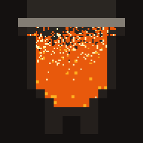

<p align="center">
  
</p>

# crucible

Crucible is an engine for running goal-directed optimization loops against a codebase or
other reversible system. An agent proposes a change, a domain-provided judge measures it,
and the engine either keeps the candidate or restores the last accepted state.

A domain is defined by a `crucible.toml` manifest and executable commands. Domain code can
use any language; no Rust integration is required.

## Execution model

For each run, Crucible:

1. prepares a Git workspace from `[repo]` and `[workspace]`;
2. records a baseline measurement unless `[judge].skip_baseline` is enabled;
3. asks the configured agent backend to modify the workspace;
4. runs the optional `[world].apply_cmd` and required `[judge].measure_cmd`;
5. keeps a valid candidate when its score improves according to `direction`, or when the
   judge reports `solved: true`;
6. restores the previous accepted state for all other candidates.

The default world implementation records accepted states as Git commits and restores
rejected states with Git. Domains that modify external state can add snapshot and restore
commands through `[world]`.

The manifest, judge, and frozen injected evaluation files form the evaluation boundary. See
the [implementation contract](docs/crucible-contract.md) for the normative behavior and
[ADR-0001](docs/adr/0001-adaptive-harness.md) for the trust model.

## Why not a general workflow engine

Crucible executes its own graph rather than delegating to Argo Workflows, Tekton, or a
similar system. The reason is not the graph, which is ordinary, but the loop around it and
the state under it.

The compiled plan is deliberately loop-free. Starlark control flow unrolls at compile time
and the resulting plan is static; the only loop is the engine's iteration over that plan,
which carries the accepted state, the best score so far, and the remaining budget across
rounds. A workflow engine would have to host that loop, and neither hosts it well: Tekton
has no loop construct at all, since a pipeline cannot reference itself and `matrix` covers
fan-out only, and Argo expresses iteration as template recursion, which accumulates every
round's nodes in a single workflow object.

Four properties of the executor have no equivalent in either system:

- **One workspace.** Tasks share a Git checkout, stage dependency files into it, and return
  results through a workspace file. Both alternatives pass parameters and archived artifacts
  between pods.
- **Validity is not scheduling.** Capability truncation is computed before anything is
  dispatched, transport failures retry while measured failures never do, and an advisory
  failure blocks dependents without invalidating the run.
- **Cost is an input.** `budget.usd` bounds a plan and `--max-cost` bounds a run; spend
  accumulates per attempt and exhausting it is a terminal state.
- **An agent turn is not a pod.** A turn runs against a sandbox owned by the agent backend
  ([ADR-0019](docs/adr/0019-openshell-kubernetes-driver.md)), not a container the graph
  runner creates.

## Requirements

Building Crucible requires:

- Rust 1.85 or newer;
- Cargo;
- a Git client for the default workspace setup and Git-backed state management.

Additional tools depend on the selected path:

- [Nushell](https://www.nushell.sh/) runs `examples/counter` and `tools/*.nu`;
- the selected agent harness and its credentials are required for real agent turns;
- OpenShell and a sandbox image are required for the `openshell` backend;
- `kubectl` and cluster access are required for deployment commands that interact with
  Kubernetes.

## Installation

Build and install from source:

```bash
git clone https://github.com/neuralmagic/crucible.git
cd crucible
cargo build --release -p crucible
install -m 755 target/release/crucible ~/.local/bin/crucible
```

Place the destination directory on `PATH`. Published binaries, when available for a
platform, are listed on the [GitHub releases page](https://github.com/neuralmagic/crucible/releases).

## Local example

The counter example exercises workspace setup, proposal, measurement, acceptance, rollback,
and Git history without a model or cluster. Its `command` backend increments the integer in
`value.txt`; the judge returns that integer as the score.

From a source checkout:

```bash
cargo run -p crucible -- \
  --manifest examples/counter/crucible.toml \
  --iterations 6
```

With an installed binary:

```bash
crucible --manifest examples/counter/crucible.toml --iterations 6
```

The example writes its workspace and run state under `examples/counter/`. Its full
configuration is in [examples/counter/crucible.toml](examples/counter/crucible.toml).

## Configure a repository

Run the initializer from the repository to optimize:

```bash
cd /path/to/repository
crucible init
```

This creates:

- `crucible.toml`, containing a local agent configuration and a placeholder goal;
- `crucible-measure.sh`, containing a valid constant-score judge.

Replace the placeholder goal and measurement logic, then validate the configuration:

```bash
crucible check --manifest crucible.toml
```

Commit both files before the first run. When `[workspace].setup_cmd` is omitted, Crucible
clones `[repo]` into `[workspace].dir`; uncommitted files in the source repository are not
included.

Start a run with an explicit iteration limit:

```bash
crucible --manifest crucible.toml --iterations 6
```

Use `crucible --help` and `crucible <command> --help` for all runtime and subcommand options.

## Manifest reference

The main manifest sections are:

| Section | Required | Purpose |
| --- | --- | --- |
| `[repo]` | scored runs | Selects one source repository by `url` or `path`, with an optional Git `ref`. A playbook may omit it and work in a workspace seeded from `[workspace].inject` alone. |
| `[workspace]` | no | Configures the workspace directory, setup command, and injected files. |
| `[agent]` | yes | Configures the backend, harness, model, goal, prompt, environment, and sandbox. |
| `[judge]` | no | Defines `measure_cmd`, score `direction`, and optional gate self-tests. Omitted entirely, the run is a task: every completed turn is kept, unscored (see [docs/task-lane.md](docs/task-lane.md)). |
| `[world]` | no | Adds apply, snapshot, and restore commands for state outside Git. |
| `[search]` | no | Configures a parallel wide round before the iterative deep loop. |
| `[workflow]` | no | Defines the task graph used by an iteration. |
| `[deploy]` | no | Defines build and deployment values used by rendered cluster runs. |
| `[build.<name>]` | no | Defines a named image build target. |
| `[publish]` | no | Configures publication of accepted changes for a single-repository run. |

Unknown manifest fields are rejected. Relative paths are resolved from the directory that
contains the manifest. A top-level `[composite]` manifest can combine multiple component
domains into one run and one judge.

The complete schema and command semantics are specified in
[docs/crucible-contract.md](docs/crucible-contract.md).

### Minimal manifest

```toml
[repo]
path = "."

[agent]
backend = "local"
goal = "Reduce the benchmark latency without changing its output."

[judge]
measure_cmd = "./crucible-measure.sh"
direction = "lower"
objective = "latency_ms"
```

With no `[workspace].setup_cmd`, Crucible clones the repository into `workspace/`. With no
`[repo]` at all, a playbook's workspace starts empty and holds only what
`[workspace].inject` lists, so a self-contained pack is `inject = ["*.py"]` and nothing
else. With no world commands, it uses Git for snapshots and restoration. With no `[judge]` at all, the run
is a task: unsupervised general-purpose work where every completed turn is kept
([docs/task-lane.md](docs/task-lane.md)).

### Workflow DSL

A domain can define its iteration graph in a `workflow.star` file beside
`crucible.toml`. The file uses a declarative subset of Starlark to create a directed acyclic
graph of agent, command, evaluation, and engine tasks.

`workflow.star` is authoring syntax. Crucible compiles it into the manifest's generated
`[workflow]` and `[[workflow.task]]` tables; the generated manifest data is the runtime
configuration. If `workflow.star` is absent, the loop uses the built-in
propose → apply → measure → decide workflow.

This example adds two isolated evaluation tasks and combines their results before the keep
or discard decision:

```python
candidate = propose(name = "propose", session = "solver")
applied = apply(name = "apply", depends_on = [candidate])

shape = evaluate(
    name = "shape",
    run = "test -s value.txt && echo '{\"pass\": true, \"score\": 1}'",
    depends_on = [applied],
    isolated = True,
)
score = evaluate(
    name = "score",
    run = "./measure.sh",
    depends_on = [applied],
    isolated = True,
)
measurement = grade(
    name = "grade",
    evidence = [shape, score],
    score = score,
)
decision = decide(name = "decide", measurement = measurement)

workflow(
    type = "autoresearch",
    tasks = [candidate, applied, shape, score, measurement, decision],
    result = decision,
)
```

Every constructor, the lane it belongs to, and its keyword arguments are in
[docs/dsl-reference.md](docs/dsl-reference.md), which is generated from the compiler's own
tables. Print the same thing for the binary in hand:

```bash
crucible plan dsl-reference           # markdown
crucible plan dsl-reference --format json
```

Two rules the reference does not carry: `type = "autoresearch"` must end in `decide()` with
valid propose, apply, and measurement ancestry, and `type = "custom"` requires an orchestrator
that explicitly admits custom workflows.

Compile a workflow for review without changing the manifest:

```bash
crucible plan compile-workflow --file workflow.star
```

Materialize the generated workflow into the manifest:

```bash
crucible plan compile-workflow \
  --file workflow.star \
  --manifest crucible.toml
```

Edit `workflow.star`, not the generated manifest block. `crucible scope` automatically
recompiles a sibling `workflow.star` before validation and freeze. A materialized engine
workflow automatically selects graph execution when the loop runs.

See [docs/work-graphs.md](docs/work-graphs.md) for plan execution and task output semantics,
and [examples/counter/workflow.star](examples/counter/workflow.star) for a complete executable
example.

### Measurement protocol

`[judge].measure_cmd` is executed through `sh -c` in the candidate workspace. Crucible
parses the last stdout line that begins with `{` as JSON:

```json
{
  "valid": true,
  "score": 12.5,
  "solved": false,
  "note": "p99=12.5ms",
  "detail": {}
}
```

Field behavior:

| Field | Required | Meaning |
| --- | --- | --- |
| `valid` | yes | `false` makes the candidate unscoreable and causes a discard. |
| `score` | yes for a valid result | Numeric value compared using `direction = "lower"` or `"higher"`. |
| `solved` | no | A valid solved candidate is kept and ends the run. Defaults to `false`. |
| `note` | no | Short human-readable summary. |
| `detail` | no | Free-form JSON object included in result data. |

A nonzero measurement exit status forces the result to be invalid. During candidate
measurements, the engine provides `CRUCIBLE_BASELINE_SCORE`, `CRUCIBLE_BASELINE_TOTAL`, and
`CRUCIBLE_BEST_SCORE` when those values are available.

### Agent backends

| Backend | Behavior | Primary requirements |
| --- | --- | --- |
| `local` | Runs the selected harness on the host in the workspace. | Harness executable and credentials. |
| `openshell` | Runs the selected harness in an OpenShell sandbox and synchronizes workspace changes. | OpenShell, `sandbox_image`, and an applicable egress policy. |
| `command` | Runs `[agent].agent_cmd` through `sh -c`. | The command and its local dependencies. |

The default harness is `claude`; `hermes` is also supported. The `command` backend is
intended for deterministic tests and integrations that provide their own proposer.

## CLI reference

Running `crucible` without a subcommand starts an optimization loop and requires
`--manifest`. The principal subcommands are:

| Command | Function |
| --- | --- |
| `crucible init` | Creates a minimal manifest and measurement script without overwriting existing files. |
| `crucible check` | Parses and validates a manifest, resolves referenced files, probes the judge, and runs configured gate self-tests. |
| `crucible scope` | Ingests a goal, optionally proposes a domain pack, validates it, and writes the frozen scope artifacts. |
| `crucible ps` | Lists rendered Crucible loop pods visible to the current Kubernetes client. |
| `crucible deploy render` | Writes digest-pinned loop-pod (or, with `--playbook`, plan-runner-pod) and RBAC YAML to stdout. |
| `crucible deploy apply` | Renders the deployment and passes it to `kubectl apply`. |
| `crucible deploy render-turn` | Renders a one-shot grounded-ranking or scoping pod. |
| `crucible plan compile-workflow` | Compiles a Starlark workflow and can materialize it in a manifest. |
| `crucible plan show` | Validates and displays a work-graph plan. |
| `crucible plan run` | Executes a plan with the shell runner or a manifest-backed agent. |
| `crucible watch-pr` | Converts authorized pull-request review comments into live steering or a reseed file. |
| `crucible fetch` | Downloads one exact S3 object URI to a local file. |
| `crucible rank-grounded` | Performs one read-only, code-grounded ranking turn over an existing checkout. |
| `crucible build` | Executes a named build configuration and prints the resulting digest-pinned image reference. |

Common loop controls include `--iterations`, `--wide`, `--wide-keep`, `--max-cost`,
`--max-time`, `--ui`, `--resume`, and `--no-early-stop`.

## Repository layout

| Path | Contents |
| --- | --- |
| `crucible/` | CLI, loop engine, manifest loading, agent backends, deployment rendering, and reporting. |
| `crucible-contract/` | Shared wire types for events, identities, sessions, and artifacts. |
| `crucible-vcs/` | Git-backed workspace and history operations. |
| `crucible-harness/` | Harness stream processing and telemetry support. |
| `crucible-broker/` | Mediated host-side operations exposed to sandboxed agents. |
| `forge/` | Container build, registry, fleet, deployment, and measurement-job support. |
| `examples/` | Executable example domains. |
| `docs/` | mdBook sources, the implementation contract, and architecture decisions. |
| `tools/` | Nushell operator and control-plane utilities. |

## Development

Build the workspace and run the repository checks:

```bash
cargo build --workspace
just lint
```

`just lint` runs formatting checks, Clippy for all workspace targets, and all workspace
tests. With `mdbook` and `mdbook-mermaid` installed, build or serve the documentation
locally:

```bash
just book
just book-serve
```

Contribution requirements are documented in [CONTRIBUTING.md](CONTRIBUTING.md). The rendered
documentation is published at [neuralmagic.github.io/crucible](https://neuralmagic.github.io/crucible/).

## License

Crucible is available under either the [MIT License](LICENSE-MIT) or the
[Apache License 2.0](LICENSE-APACHE).
