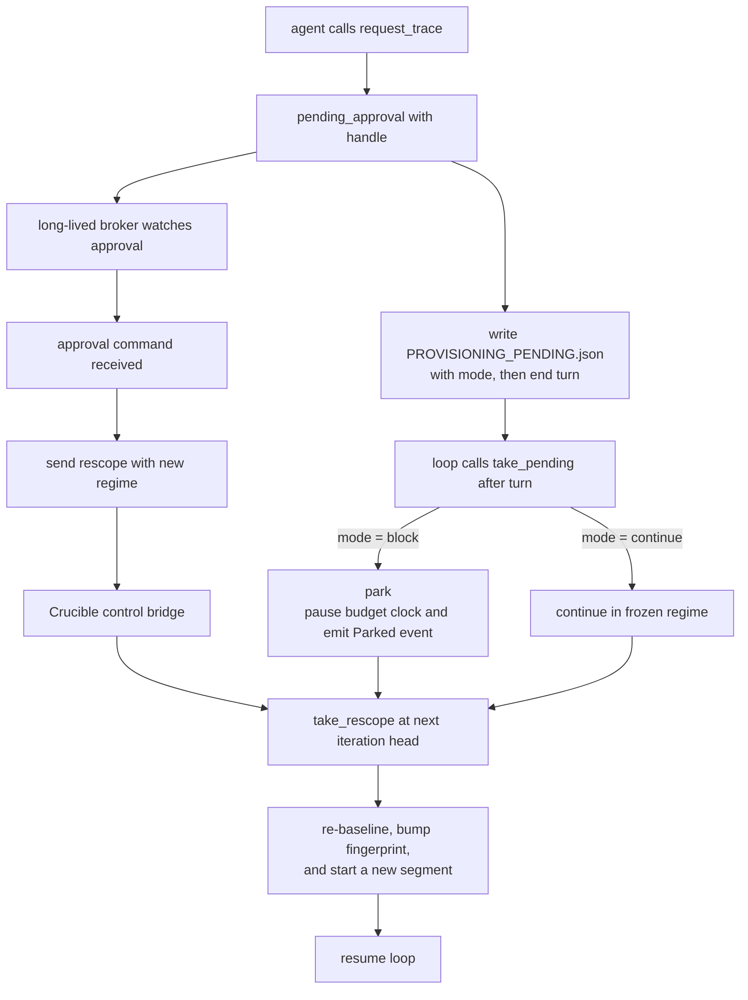

# ADR 0003: Async approval waits — the agent decides block vs continue

**Status:** Accepted; implemented (park/rescope/deny + `ParkOutcome` live in `loop_driver.rs`; the budget clock pauses while parked)
**Date:** 2026-06-25
**Context owner:** agentic-epp-autoresearch
**Related:** [ADR-0001](./0001-adaptive-harness.md) (freeze the judge; the solution/evaluation
split), [ADR-0002](./0002-mediated-provisioning-mcp.md) (the broker, `pending_approval`, the
re-scope), the control bridge (`crucible/src/control.rs`), the engine re-scope path (`run_loop`'s
`take_rescope` → `run_baseline` → new fingerprint segment), the `escalate` marker hook
(`crucible/src/escalation.rs`).

## Context

ADR-0002 decision 5 says a judge-changing request can open an **async** approval (a draft PR or a
control-bridge ask) and "the loop records the ask and continues / parks; the human approves a batch
out-of-band." It specified the *approval* — open a PR, poll for `/approve-capture` — but not what
the run actually *does* between the ask and the answer, nor how it *resumes*. Today the only built
behavior is the degraded floor: `BROKER_DEGRADED=1` → judge-changing misses escalate-halt
(`Resolution::Escalate`). That is correct when there is no approval surface, but
it is not the wait-and-resume we actually want when there *is* one.

Two things need pinning:

1. **Where the wait lives.** The agent turn is ephemeral — a per-turn OpenShell sandbox, torn down
   when the turn ends. It cannot "sit and wait"; making it spin-poll `check_capture` inside a turn
   burns tokens on a paid sandbox to do nothing. The long-lived thing is the **loop** (`crucible`,
   the pod's entrypoint process). The wait is the loop's.
2. **Whether to block the whole run.** Parking the run idles a pod on a human. Sometimes that's
   right (the pending regime is the agent's only path); sometimes it's waste (the agent has other
   frozen-regime hypotheses to test meanwhile). Only the agent has the context to know which.

## Decision

**The broker decides *whether* a regime change is allowed (privilege + evaluation, server-side,
ADR-0002). The agent decides *how to spend the wait* (solution-space, ADR-0001). The loop owns the
wait and the resume.** Concretely:

1. **The wait is the loop's, not the turn's.** On `pending_approval`, the agent records the ask and
   **ends its turn** — it never spin-waits in the sandbox (the `request-trace` skill already says
   "async by design; do not spin-wait a whole turn"). The loop reads the ask after the turn and
   acts.

2. **The agent chooses the wait mode**, written into the marker it leaves:
   - **`block`** — "this regime is my only path." The loop parks until the approval resolves.
   - **`continue`** — "I have other frozen-regime work." The loop keeps iterating; the re-scope
     lands whenever approval arrives.
   This is a solution-space call (how to use time), not an evaluation one — so it is the agent's,
   exactly as ADR-0001 draws the line. The broker's yes/no is unchanged and still server-side.

3. **One wake mechanism for both modes.** Whichever mode, the **broker** (it holds the PR + the
   forge token; its *process* is long-lived even though the HTTP transport is stateless — ADR-0002
   note) watches the approval. On `/approve-capture` it sends a `rescope{regime}` command to
   `crucible`'s control bridge (`localhost:<control-port>`), becoming a control-bridge *client*.
   `crucible`'s existing re-scope path drains the pending re-scope at the next iteration head:
   re-baseline at the new regime, bump the harness fingerprint, open a new comparable segment,
   resume. **The mode only gates whether the loop idles or keeps iterating while the watch runs —
   it is not a second system.** `crucible` polls nothing; it parks (or not) until a rescope arrives.

   **Two async phases, one terminal signal.** There are actually *two* waits after
   `pending_approval`: (1) the human (approval) and (2) the **provisioning** — the GPU capture that
   produces the calibrated trace + `MOCK_*` knobs. The loop's park waits for a single *terminal*
   outcome; the watcher must only send the `rescope` once provisioning is **ready**, not merely
   approved (else the re-baseline measures an uncalibrated regime). So the correct watcher flow is
   `poll approval → submit capture → poll capture until ready → send rescope`. The capture
   submit/poll is the **capture-wait boundary** in `watch.rs`, backed by the Kueue/trace backend.
   Because the loop already parks for the terminal signal, only that boundary changes as the backend
   evolves; the simplest form has the watcher send `rescope` on approval. The terminal outcomes the
   park waits on: `rescope` (ready → resume),
   `deny` (rejected → resume-frozen or escalate), or a `--max-park` timeout (→ treated as deny).

4. **The decision rides on a marker** (mirror of the `escalate` hatch): the agent writes
   `PROVISIONING_PENDING.json` in its workspace; the loop reads + consumes it post-turn with a
   `take`-style hook beside `escalation::take`. Schema below.

5. **Budget treatment follows the mode.** `block` **pauses** the cost/time clock — an idle wait on a
   human must not count against `--max-cost` / `--max-time`. `continue` keeps spending, because the
   agent is doing real work. This falls out of which loop state we're in.

6. **Two interchangeable human channels, same rescope** (ADR-0002's two approval backends):
   - **Forge (headless):** comment `/approve-capture <trace_id>` on the draft PR. The broker's
     `DraftPr` poll catches it. Approve from anywhere; the parked pod resumes minutes later.
   - **Control bridge (attended):** the `ControlBridge` channel surfaces the ask as a viewer event;
     the operator watching `crucible view --pod` approves with a keystroke (`a`), the same
     exec/control path `s`/`x` already use (`crucible/src/tui/remote.rs`). Immediate.

7. **Deny / timeout is not a harness failure.** On `denied` or a max-park timeout, the loop
   **discards the regime change and resumes in the frozen regime** with a note — a human declining a
   goalpost move is a normal outcome, not an escalation. The exception: if the agent declared
   `block` *because* it had no fallback, a denial leaves nothing to do, so it escalate-halts
   (`ESCALATION.json`, exit 2) — the honest "I am genuinely stuck" signal.

## What this is NOT

- **Not** the agent polling inside a turn. Turns are ephemeral and paid; the loop waits, the agent
  does not.
- **Not** the broker (or the harness) deciding how to spend the wait. That's the agent's
  solution-space call — the whole point of letting it choose `block` vs `continue`.
- **Not** a new evaluation path. Resume is the existing re-scope (new baseline + fingerprint +
  segment); the approval just feeds its pending slot. The judge is never edited in place.
- **Not** a replacement for `escalate`. Escalation stays the floor for the *un-grantable* and the
  no-approval-surface degraded case (ADR-0002 decision 6). This ADR is the *grantable-but-pending*
  case: a human will answer, the run just has to wait for it.

## The marker

`PROVISIONING_PENDING.json`, written by the agent in its workspace (consumed + deleted by the loop,
so a stale file can't re-trigger on resume):

```json
{
  "trace_id": "model=Qwen/Qwen3-0.6B;c=48;p=8;mt=8;lt=0;lf=0.0000",
  "regime":   { "model": "Qwen/Qwen3-0.6B", "concurrency": 48, "prefixes": 8,
                "max_tokens": 8, "long_tokens": 0, "long_frac": 0.0 },
  "handle":   "https://github.com/<org>/<repo>/pull/NNN",
  "mode":     "block"
}
```

`mode` defaults from behavior when the agent omits it: a turn that produced a measurable
`CANDIDATE.md` (a frozen-regime fallback change) implies `continue`; a turn that produced only the
ask implies `block`. Explicit beats implicit — the skill asks the agent to declare it.

## Architecture sketch



## Consequences

- **Positive:** the run can genuinely wait for a human and resume, headless or attended, without the
  agent burning paid sandbox time spinning. The honest "is this worth blocking the whole run?" call
  sits with the only actor that has the context — the agent.
- **Positive:** almost entirely reuse. The wake is the existing re-scope path; the transport is the control bridge; the
  marker is the `escalate` pattern; the channels are ADR-0002's two backends; the viewer keystroke
  is the `s`/`x` path. The genuinely new code is small: the marker + `take` hook, a parked loop
  state (a budget-paused `pause` that a rescope wakes), the broker's PR-watcher → control-bridge
  sender, and the viewer `a` key.
- **Negative / cost:** a parked pod idles on a human (cheap — no tokens, paused budget — but a real
  pod-hour). A max-park timeout bounds it. The broker now also runs a background watcher with state
  across requests (fine: its *process* is long-lived; only the HTTP transport is stateless).
- **Negative / cost:** `continue` mode interleaves a frozen-regime segment with a later re-scoped
  one in the same run; the session log already models segments, so the story stays readable,
  but a reader must respect segment boundaries (scores across one are not comparable — ADR-0001
  safeguard 2).

## Design notes

- **Max-park timeout + denial default:** `--max-park <dur>` (empty = wait indefinitely) bounds the
  wait; a timeout is treated as a denial. A `block` denial **escalate-halts** (the agent had no
  fallback by definition of `block`); a `continue` denial just **stays in the frozen regime** with a
  note. This lives in `loop_driver.rs` (`ParkOutcome`) + the `deny` control command.
- **Broker → control-bridge address:** crucible injects `BROKER_CONTROL_ADDR=127.0.0.1:<port>`
  when it spawns the broker; same-pod loopback is the trust boundary (`broker.rs` / `watch.rs`).
- **Control-bridge grammar at scale:** the `approve`/`deny` commands handle a single ask in flight;
  a *queue* of asks plus viewer keys (`a`/`d`) and dedupe on re-press extend the same channel.
- **Resume fidelity in `block`:** a long park may outlive the rig's last-good snapshot or the
  sandbox gateway's warm state, so re-baseline after a wake must re-establish both cleanly.

## Principle, restated

The host decides what may be granted; the agent decides what to do while it waits; the loop holds
the door open and walks through it when the human says yes. Waiting is solution-space — the agent's
to spend — but the gate it waits on, and the re-scope it resumes into, stay the host's.
