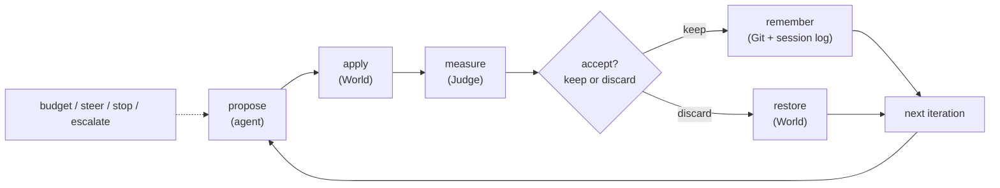

# Crucible: what it is, in one read

Crucible is a **goal-driven, gated, keep/discard loop** for letting an agent improve a
codebase against a frozen objective. The loop itself is domain-agnostic; a *domain* is a
problem packaged for it.

This doc explains the whole system in higher-order concepts and then shows exactly how
the `examples/counter` domain maps onto them. For *why the judge is frozen*, see
[ADR 0001](./adr/0001-adaptive-harness.md).

> **Scope.** The engine, the `World`/`Judge` boundary, `CommandWorld`/`CommandJudge`, and the
> `crucible.toml` manifest form the core. A **composite** manifest
> ([ADR 0009](./adr/0009-composite-domains.md)) exercises the engine across multiple
> components. Around the loop: mediated provisioning + issue-tracker grounding over an MCP
> broker ([ADR 0002](./adr/0002-mediated-provisioning-mcp.md)), a profiler over MCP
> ([ADR 0006](./adr/0006-profiling-over-mcp.md)), engine-side build/deploy
> ([ADR 0005](./adr/0005-engine-side-builds.md)) with rendered deployment manifests
> ([ADR 0012](./adr/0012-rendered-deployments.md)), and publish-on-keep with a draft PR
> per fork whose authorized review comments re-steer the run.

## The one sentence

An optimization loop where the **proposal** step is an LLM agent and the **objective** is
a frozen, expensive black-box evaluation, over a **reversibly-mutable** world, with
**durable memory** and **human-in-the-loop control**.

## The loop



- **propose**: the agent edits the world toward the goal. The proposal policy is a
  pluggable backend (`local` in-process Claude / `openshell` sandboxed / `command`),
  selected by `[agent].backend`, not the engine.
- **apply**: make the candidate live (for a code repo: the edits *are* the apply).
- **measure**: the frozen Judge scores the candidate.
- **accept?**: keep if it's strictly better; otherwise restore the last good state.
- **remember**: kept states are git commits; every step is an NDJSON event.

This single-candidate line of descent is the default, and it's not the only shape: a
**wide round** ([ADR 0010](./adr/0010-candidate-portfolios-and-search.md)) can fan `N`
independent propose turns out in parallel first, biased to distinct `[search].approaches`,
rank them by the same Judge, and seed the loop above with the winner. `--wide 0` (the
default) skips it entirely, no engine change, just a pre-loop step.

## The contract: framework owns it, the repo owns the implementations

Crucible defines a small contract; a repo fills it however it
likes, in any language. A domain is **a manifest + a few executables**, not Rust code.
Each command runs in the workspace with the domain's env:

| Command | Required | Contract |
| --- | --- | --- |
| `measure` | yes | last stdout line = `{ "valid": bool, "score": number, "solved"?: bool, "note"?, "detail"? }`; nonzero exit = invalid. **The judge.** Gets `BASELINE_*`/`BEST_SCORE` in env. |
| `apply` | no | apply the candidate. Omit for code repos (the agent edits files); deploy domains build+push+set-image. |
| `snapshot` | no | stdout = an opaque token for the current state. Default: git commit ref. |
| `restore <token>` | no | roll back to a token. Default: `git reset --hard` + `clean`. |
| `setup` | no | prepare the workspace. Default: git clone + checkout. |

The accept policy is generic: *keep if `valid` and `score` beats the best per
`direction`; solved iff `measure` says so.* No per-domain code for the keep/win logic.

### Carrying pipeline artifacts across a discard

A discard resets the workspace and cleans untracked files, so anything an iteration derived
on the way to its candidate (code traces, a generated port tree) is gone by the next turn and
gets re-derived. `[workspace] carry_forward` names workspace-relative paths that survive:

```toml
[workspace]
carry_forward = ["codegen-out/"]
```

Each entry is written to `.git/info/exclude` and spared by the discard's clean, so carried
content never reaches a candidate diff, snapshot commit, or tree hash: a turn that only
regenerates it still reads as no candidate change.

Limits worth knowing before you use it:

- A path the repo **tracks** is not protected. Git excludes only apply to untracked files, and
  the discard's `git reset --hard` reverts tracked content regardless. Carry pipeline output
  the repo doesn't track.
- A path that doesn't exist yet is fine; the exclude is prospective.
- Nested paths (`target/codegen-out`) work: the clean descends into the parent instead of
  deleting it. Entries must be plain relative paths, so no `.`, `..`, or leading `/`.
- Wide-tournament rounds run in fresh worktrees with no untracked carried dirs, so they don't
  benefit.
- Composite manifests reject the key; per-component carry-forward is a non-goal.

Omitting it is the default and keeps today's fresh-start behavior exactly, which is what a
methodology-sensitive campaign wants.

### Languages: pick per command, the engine doesn't care

The contract is JSON + exit codes, so each command can be whatever fits:

- **Thin glue** (apply / ops / steer / stop): **nushell** is the recommended default.
  The work is "run kubectl/prometheus, parse, compute," and nushell is structured-data
  native (`... | from json | ...` in, a record `| to json` out), cleaner than bash,
  lighter than python. (It's its own shell, not posix; pin `nu` in the sandbox image.)
- **Heavy `measure`** with real math (percentiles, replay): a compiled binary
  (Rust/go) earns its keep.
- bash / python / anything else is equally valid: only the JSON/exit shape is fixed.

`measure_cmd` is any executable that prints one JSON object on stdout
(`{"valid": bool, "score": number, "note": string}`). A plain POSIX shell script
satisfies the whole contract:

```sh
#!/bin/sh
p99=$(make bench | jq .p99_ms)
printf '{"valid": true, "score": %s, "note": "p99 %sms"}\n' "$p99" "$p99"
```

Any language works the same way, because the engine reads only the JSON verdict.

## What the engine gives you for free

| Concept | What it does | Where |
| --- | --- | --- |
| **Engine** | the loop, budget, keep/discard, baseline | `main::run_loop` |
| **World** | reversibly-mutable state; opaque `Snapshot` | `crucible::World` → `GitWorld` / `CommandWorld` |
| **Judge** | frozen objective: measure + decide | `crucible::Judge` → `CommandJudge` |
| **Agent** | proposal policy + transport (local / remote pod) | `agent::AgentSource` |
| **Reporters** | console / NDJSON / session-log frontends | `reporter::Reporter` + `console`/`stream` |
| **Session log** | versioned NDJSON event stream (the source of truth) | `session.rs` |
| **Memory** | git-as-memory (kept commits) + `RESULTS.md` | `vcs.rs` + `write_results` |
| **Control plane** | steer / stop-park / resume / escalate | `STEER.md` / `state/control.json` / `--resume` / `ESCALATION.json` |
| **Provisioning** | mediated MCP broker: the agent asks, the host holds the keys (GPU capture, issue-tracker grounding, draft PRs) | `crucible-broker` (ADR-0002) |
| **Profiler** | generic profile-over-MCP: pprof for a Go service, GPU traces for a model server | `crucible-broker::profile` (ADR-0006) |
| **Build + deploy** | engine-side build, and `crucible deploy render` projects the loop/deployment manifests, digest-pinned | `forge` + `crucible/src/deploy/` (ADR-0005 / 0012) |
| **Publish** | publish-on-keep to S3 + a draft PR per fork; authorized review comments re-steer the run | `publish.rs` / `crucible-broker::draft_pr` |
| **Search (wide round)** | optional fan-out of N parallel propose turns, ranked by the same Judge, before the deep loop ([ADR 0010](./adr/0010-candidate-portfolios-and-search.md)) | `crucible/src/wide/` |
| **Self-test** | `crucible check` proves the Judge can tell a known-good config from a known-bad one before a run trusts it | `[judge.selftest]` + `selftest.rs` |
| **On-ramp** | `crucible init` scaffolds a manifest + measure stub onto an existing repo; `crucible check` validates it with no agent turn; `crucible scope` ingests a goal and freezes a `SCOPE.md` (ADR-0014 S0) | `init.rs` / `check.rs` / `scope.rs` |

An optional private control plane can sit above all of this: a controller that discovers
candidate issues, scopes them into packs, launches runs, and renders run records into
leaderboards. It consumes the public `crucible-contract` ingest API over HTTP; the engine
and loop pods never link it, and everything on this page runs identically without one.

Trust boundary (ADR-0001): the engine hands the agent a `World`, never a `Judge`. The
objective is frozen and out of the agent's reach: the agent can't tune the test it's
graded on. The same boundary runs through provisioning: the agent can only *ask* the broker
(over MCP); the privilege (GPU/Kueue, capture RBAC, the forge token, the issue-tracker
credential) stays host-side, never in the agent's sandbox.

<div class="cru-callout">
  <p><strong>Two ways to build a candidate, neither runs in the agent.</strong> When a candidate is a real source build (a compiled service's Dockerfile), <code>forge</code> drives <strong>buildah</strong>. When it's just "the base image plus an edited file or two" (an interpreted-source overlay, e.g. one Python file), <code>forge::oci::derive_layer</code> appends one tar+gzip layer onto the base and pushes an immutable, digest-pinned image with <strong>no container runtime</strong> (<code>oci-client</code> + <code>sha2</code>/<code>tar</code>/<code>flate2</code>): base layers move by a server-side blob <em>mount</em> when the registries match, else a low-memory pull→push stream. That replaces the old runtime configmap-overlay (version skew, <code>subPath</code> mounts, volume juggling on restore) with <code>set image</code> to a digest, so snapshot/restore collapses to a ref. <code>forge-derive-layer</code> is the CLI that validates the round-trip on-cluster.</p>
</div>

## The three extension points

- **New domain →** common case: a manifest pointing `CommandWorld` + `CommandJudge` at a
  repo and a `measure` command. *No Rust.* Custom `World`/`Judge` impls only for
  in-process measurement or a non-file world.
- **Composite domain →** assemble N existing component domains into one run: a top-level
  `[composite]` table referencing component domain dirs (reused verbatim), a `CompositeWorld`
  (a tuple of per-component git overlays + the live deployment), and one combined gate over
  the assembled stack. No engine changes: the engine just runs a *vector* of workspaces
  ([ADR 0009](./adr/0009-composite-domains.md)).
- **New frontend →** implement `Reporter`.
- **New agent transport →** add an `AgentSource`.

## The canonical example: the counter, mapped to the contract

`examples/counter/` is the whole system with every heavy part swapped for the smallest
thing that satisfies the contract. Five small files, and each one fills a **contract
role**. This table *is* the example:

| File | Lang | Contract role |
| --- | --- | --- |
| `crucible.toml` | toml | **manifest** (`[repo] path = "."`, `direction = "higher"`, no `[world]` → GitWorld) |
| `measure.nu` | nu | **measure** (score = the integer in `value.txt`; `solved` at ≥ 5) |
| `bump.nu` | nu | **propose** via the `command` backend (deterministic: `value.txt += 1`; no LLM, no cost) |
| `setup_cmd` (inline in the manifest) | sh | **setup** (seed a fresh git workspace with only the runtime files) |
| `method.md` | md | **method prompt** (only used if you flip `backend = "local"`) |

Because there is no `[world]` block, GitWorld supplies reversibility for free: kept
iterations are commits, discards are `git reset --hard`. Because the backend is `command`,
the whole loop runs in milliseconds and costs nothing, yet it is a real end-to-end run
(manifest → setup → propose → measure → keep/discard → git memory), not a mock.

A production domain fills the same roles with heavier pieces. A serving-stack domain has
*two* reversible things (the code tree **and** a live deployment), so it adds
`snapshot_cmd`/`restore_cmd` that capture image + config alongside the git half; its
`measure` becomes a compiled benchmark binary; its propose backend becomes `local` or
`openshell`; and its thin glue (apply pipelines, deployment introspection, steer/stop)
lands on PATH as **bare names** so the contract vocabulary reads the same regardless of
what's behind each one. A normal repo needs none of that: one `measure` command and the
git default.

## Adding a new domain (the target workflow)

1. `crucible init` scaffolds a starter `crucible.toml` + measure stub onto the repo (or write
   one by hand):
   ```toml
   [repo]      url|path, ref
   [workspace] setup_cmd          # optional; default: git clone + checkout
               carry_forward      # optional; untracked derived paths a discard keeps
   [agent]     model, method_prompt, goal_file|goal, toolbox_dir, env
   [judge]     measure_cmd, direction = "lower"|"higher"
   [world]     apply_cmd?, snapshot_cmd?, restore_cmd?   # omitted → git
   ```
2. Write a `measure` command (any language) that prints `{valid, score, solved?}`.
3. `crucible check --manifest crucible.toml` validates it (every referenced file resolves,
   `measure_cmd` runs once and prints the contract shape) with no agent turn spent.
4. Run `crucible --manifest crucible.toml`. You get the loop, budget, all frontends,
   steer/stop/resume, the session log, and escalation, free.

The litmus test for "framework, not demo": any second repo runs this way with **no
new Rust**.

## Concept → code (where to look)

- loop / budget / keep-discard: `crucible/src/run.rs` + `crucible/src/loop_driver.rs`
- the contract traits: `crucible/src/crucible.rs`
- World/Judge batteries: `crucible/src/command_world.rs` (`GitWorld`/`CommandWorld`/`CompositeWorld`), `crucible/src/command_judge.rs` (`CommandJudge`)
- composite domains: `crucible/src/manifest.rs` (`CompositeManifest`) + `crucible/src/run.rs` (`run_composite`)
- mediated broker (provisioning / issue tracker / profiler / draft PR): `crucible-broker/`
- engine-side build + rendered deploy: `forge/` (build, native-OCI derive, kube-rs) + `crucible/src/deploy/`
- agent transport: `crucible/src/agent.rs`
- frontends: `crucible/src/{console,jsonl,stream}.rs`
- session log wire format: `crucible/src/session.rs`
- the example domain: `examples/counter/` (manifest + `measure.nu` + `bump.nu`)
