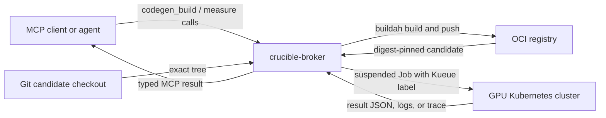

# Hand-rolled codegen pipelines

This document describes how to run Crucible's brokered code-build and GPU-measurement tools
without the controller or optimization loop. Use this path to validate a new domain's tool
contract, test a GPU substrate, or diagnose build and measurement failures.

The normal deployment path remains a manifest-driven loop rendered by `crucible deploy`.

## Current architecture

The broker owns registry credentials and Kubernetes access. Its caller supplies source edits
and a restricted set of declared arguments; it does not supply build credentials, arbitrary
job specifications, or measurement commands.



The data path has four invariants:

1. `codegen_build` hashes the candidate tree and builds that exact tree.
2. The registry result is resolved to an immutable digest.
3. Measurement tools accept only digests produced by `codegen_build` during the current
   broker lifetime.
4. Benchmark, evaluation, and profile commands are loaded from trusted configuration rather
   than accepted from the caller.

GPU measurement jobs run the candidate image directly. Do not mount the source workspace
over the candidate's installed tree: that would make the measurement depend on mutable files
instead of the recorded image digest.

## Prerequisites

The machine or pod running `crucible-broker` needs:

- the `crucible-broker` binary;
- `buildah`, `git`, and `tar` on `PATH`;
- a writable build and log directory;
- containers-auth JSON credentials for any private base and candidate registries;
- network access to the OCI registry;
- Kubernetes credentials for the measurement cluster.

The Kubernetes target needs:

- Kueue and a configured LocalQueue;
- nodes that provide the requested `nvidia.com/gpu` resource;
- permission for the broker identity to create, inspect, and delete Jobs, read Pods and pod
  logs, and inspect Kueue Workloads;
- an image-pull Secret in the measurement namespace when the candidate registry is private;
- any model-cache or trace-transport PVCs referenced by the broker configuration.

Build the standalone broker from this repository:

```bash
cargo build --release -p crucible-broker
```

For a remote or delegated cluster, validate submission and Kueue admission with the CPU-only
sentinel before using a GPU:

```bash
target/release/crucible-broker spoke-smoke gpu-east \
  --kubeconfig /path/to/kubeconfig \
  --context gpu-east \
  --namespace crucible-measure \
  --queue crucible-measure
```

Use `--image` when the cluster cannot pull the default public sentinel image.

## Configuration model

Rendered deployments separate domain configuration from cluster configuration:

| Source | Owns | Broker projection |
| --- | --- | --- |
| Domain manifest `[measure]` | GPU count, build recipe, frozen commands, objectives, mutable argument domains | `BROKER_CODEGEN=1`, `BROKER_CODEGEN_TOOLS_DEFAULTS` |
| Deploy profile `[measure]` | Namespace, LocalQueue, PVC names, GPU ceiling, source path, delegated cluster | `BROKER_CODEGEN_*` substrate variables |
| Scenario or run overlay | Allowed per-run changes to the domain defaults | `BROKER_CODEGEN_TOOLS_OVERLAY` |

For a hand-rolled deployment, provide the equivalent environment variables directly.

### Frozen tool contract

`BROKER_CODEGEN_TOOLS_DEFAULTS` is a JSON object. The following example is validated by the
broker's own configuration test:

```text
BROKER_CODEGEN_TOOLS_DEFAULTS = {
  "gpus": 2,
  "build": {
    "base_image": "registry.example.com/project/base@sha256:0123456789abcdef",
    "src_dir": "/workspace/project",
    "install_cmd": "python -m pip install -e . --no-deps",
    "full_install_cmd": "MAX_JOBS=4 python -m pip install -e . --no-deps",
    "copy_chown": "1000:1000",
    "mutable_kwargs": {
      "mode": ["derive", "full"]
    }
  },
  "benchmark": {
    "command": "python /opt/crucible/benchmark.py --out \"$OUT\"",
    "output_len": 1024,
    "num_prompts": 4,
    "objective": {
      "key": "tpot_ms",
      "direction": "lower"
    },
    "mutable_kwargs": {
      "toggles": {
        "PROJECT_FEATURE": ["0", "1"]
      },
      "reps": {
        "min": 1,
        "max": 3,
        "default": 1
      }
    }
  },
  "lm_eval": {
    "command": "python /opt/crucible/evaluate.py --out \"$OUT\"",
    "objective": {
      "key": "score",
      "direction": "higher"
    },
    "mutable_kwargs": {
      "limit": {
        "min": 32,
        "max": 500,
        "default": 500
      }
    }
  },
  "profile": {
    "command": "python /opt/crucible/profile.py --out \"$OUT\"",
    "trace_ext": "json.gz"
  }
}
```

Required fields are `gpus`, `build.base_image`, `build.src_dir`, `build.install_cmd`,
`benchmark.command`, and `lm_eval.command`. The `profile` section is optional. Omitting it
makes `codegen_profile` return `unconfigured`.

Build modes have distinct purposes:

| Mode | Configuration | Intended use |
| --- | --- | --- |
| `derive` | `build.install_cmd` | Interpreted or otherwise fast-installing source changes. |
| `full` | `build.full_install_cmd` | Changes that require compilation. |

Only modes listed in `build.mutable_kwargs.mode` are accepted. `derive` is the only default
mode when no list is declared. Every other optional caller argument is also rejected unless
its domain is declared under `mutable_kwargs`.

`BROKER_CODEGEN_TOOLS_OVERLAY`, when set, uses the same JSON shape. Its fields override the
defaults and unspecified fields continue to come from `BROKER_CODEGEN_TOOLS_DEFAULTS`.

### Standalone substrate environment

Set these values before starting the broker:

| Variable | Required | Purpose or default |
| --- | --- | --- |
| `BROKER_CODEGEN` | yes | Set to `1` or `true` to enable the codegen tools. |
| `BROKER_CODEGEN_TOOLS_DEFAULTS` | yes | Frozen tool-contract JSON described above. |
| `BROKER_CODEGEN_SANDBOX_WORKDIR` | yes for a local standalone run | Candidate checkout used when no live OpenShell sandbox is available. |
| `BROKER_CODEGEN_NAMESPACE` | yes | Namespace for measurement Jobs. |
| `BROKER_CODEGEN_QUEUE` | no | Kueue LocalQueue; defaults to `crucible-measure`. |
| `BROKER_CODEGEN_MAX_GPUS` | no | Maximum admitted GPU count; defaults to `2`. |
| `FORGE_REGISTRY` | yes | Candidate image repository without a tag. |
| `FORGE_AUTHFILE` | yes | Containers-auth JSON used for build push and digest resolution. |
| `REGISTRY_AUTH_FILE` | for a private base | Containers-auth JSON used by Buildah while pulling the base image. |
| `FORGE_STORAGE_ROOT` | no | Build staging, logs, and budget state; defaults to `/var/lib/forge`. |
| `KUBECONFIG` | depends | Kubernetes config for an out-of-cluster broker; in-cluster service accounts use ambient config. |
| `BROKER_CODEGEN_PULL_SECRET` | for private candidates | Image-pull Secret in the measurement namespace. |
| `BROKER_BIND` | no | MCP bind address; defaults to `0.0.0.0:8849`. |
| `BROKER_TOKEN` | recommended | Bearer token required by the MCP endpoint. |

Optional Job sizing variables are `BROKER_CODEGEN_CPU` (default `16`),
`BROKER_CODEGEN_MEM_REQUEST` (`128Gi`), `BROKER_CODEGEN_MEM_LIMIT` (`200Gi`),
`BROKER_CODEGEN_SHM_GI` (`16`), `BROKER_CODEGEN_DEADLINE_SECONDS` (`5400`), and
`BROKER_CODEGEN_TTL_SECONDS` (`86400`). Queue wait time is allowed in addition to the Job's
active deadline.

Optional volume variables are:

- `BROKER_CODEGEN_MODEL_PVC` and `BROKER_CODEGEN_MODEL_MOUNT` for a read-only model cache;
- `BROKER_CODEGEN_ARTIFACTS_PVC`, `BROKER_CODEGEN_ARTIFACTS_MOUNT`, and
  `BROKER_CODEGEN_ARTIFACTS_DIR` for profile trace transport;
- `BROKER_CODEGEN_WORKSPACE_PVC` and `BROKER_CODEGEN_WORKSPACE_MOUNT` for legacy workloads
  that explicitly require a workspace mount.

Do not set `BROKER_CODEGEN_WORKSPACE_PVC` for normal measurements. The rendered deployment
intentionally omits it so a workspace volume cannot shadow files baked into the candidate image.

To delegate Jobs to a separate cluster, set `BROKER_CODEGEN_KUBECONFIG`. Optional companion
variables are `BROKER_CODEGEN_KUBE_CONTEXT`, `BROKER_CODEGEN_PROXY_URL`,
`BROKER_CODEGEN_CLUSTER`, and `BROKER_CODEGEN_CLUSTER_TIER`. Without a delegated kubeconfig,
the broker uses its ambient in-cluster client or the standard local kubeconfig resolution.

### Example startup

Store the JSON object from the tool-contract example in `tools.json`, then start the broker
in the foreground:

```bash
export BROKER_CODEGEN=1
export BROKER_CODEGEN_TOOLS_DEFAULTS="$(jq -c . tools.json)"
export BROKER_CODEGEN_SANDBOX_WORKDIR=/path/to/project
export BROKER_CODEGEN_NAMESPACE=crucible-measure
export BROKER_CODEGEN_QUEUE=crucible-measure
export BROKER_CODEGEN_MAX_GPUS=2
export FORGE_REGISTRY=registry.example.com/project/candidates
export FORGE_AUTHFILE=/path/to/containers-auth.json
export REGISTRY_AUTH_FILE=/path/to/containers-auth.json
export FORGE_STORAGE_ROOT=/path/to/writable/forge-state
export KUBECONFIG=/path/to/kubeconfig
export BROKER_CODEGEN_PULL_SECRET=registry-pull
export BROKER_BIND=127.0.0.1:8849
export BROKER_TOKEN="replace-with-a-random-token"
export STORAGE_DRIVER=vfs

target/release/crucible-broker
```

Run the broker as the foreground process in a container or pod. A background broker tied to a
short-lived shell or `sleep` process will disappear while calls are still in flight.

## Connect an MCP client

The endpoint is streamable HTTP at `/mcp`. A Claude-compatible client configuration for a
broker running on the same host is:

```json
{
  "mcpServers": {
    "crucible": {
      "type": "http",
      "url": "http://127.0.0.1:8849/mcp",
      "headers": {
        "Authorization": "Bearer <random-bearer-token>"
      }
    }
  }
}
```

For a sandboxed caller, use the address reachable from that sandbox. Crucible-generated
configurations use `host.containers.internal` for the Podman driver and
`host.openshell.internal` for the Kubernetes driver. A custom hostname must also be added to
`BROKER_ALLOWED_HOSTS` on the broker.

The MCP server name controls the agent-visible prefix. The example above exposes tools as
`mcp__crucible__codegen_build`, `mcp__crucible__codegen_benchmark`, and so on.

## Tool reference

| Tool | Arguments | Successful result |
| --- | --- | --- |
| `codegen_build` | `mode` (`derive` by default) | `built` with `tree_hash`, source, digest, mode, cache state, and build-log handle. |
| `codegen_benchmark` | built `digest`; optional `toggles`, `reps` | `measured` with numeric metrics, objective, log handles, and cache state. |
| `codegen_lm_eval` | built `digest`; optional `limit` | `measured` with the configured objective score, log handles, and cache state. |
| `codegen_profile` | built `digest` | `profiled` with a binary trace handle, log handles, and cache state. |
| `codegen_jobs` | none | The broker's in-flight and recent GPU Jobs with Kueue, Pod, lifecycle, and log-handle data. |
| `fetch_log` | `handle`; optional byte `offset` | A text window with `next_offset` and `total_bytes`. |
| `fetch_trace` | `handle`; optional byte `offset` | A base64-encoded binary window with `next_offset` and `total_bytes`. |

The normal call sequence is:

1. Call `codegen_build` and retain the returned digest.
2. Pass that digest to `codegen_benchmark` and `codegen_lm_eval`.
3. Call `codegen_profile` when the contract includes a profile command.
4. While a GPU call is blocked, use a concurrent MCP request to call `codegen_jobs`, then tail
   its log handle with `fetch_log`.
5. Read profile artifacts with `fetch_trace`, base64-decode each window, and concatenate the
   decoded bytes in offset order.

Benchmark, lm-eval, and profile calls block until their Jobs finish. `codegen_jobs` keeps an
in-memory ring of at most 20 Jobs and reports newest first. Cluster-derived lifecycle data is
best-effort; an unavailable live lookup produces `unknown` rather than a false queued or running
state.

## Frozen command output

The broker runs configured measurement commands through `/bin/sh -c` inside the candidate
image. It sets `OUT` to the result path and `HF_HUB_OFFLINE=1`. Each command must create the
file named by `$OUT` and exit successfully.

### Benchmark

The benchmark output must be a JSON object with at least one top-level numeric or boolean
field. All such fields are returned as metrics. When the object contains `elapsed_time`, the
broker also derives `tpot_ms` and `tokens_per_s` using the configured `output_len` and
`num_prompts`; a JSON `num_requests` field overrides the configured prompt count.

Declared benchmark toggles are passed as environment variables. Declared `reps` is passed as
`CRUCIBLE_BENCH_REPS`.

### Language-model evaluation

The lm-eval output must contain a numeric value under the configured objective key, either at
the top level or one object level below it. A declared `limit` is passed as
`CRUCIBLE_LM_EVAL_LIMIT`.

### Profile

The profile command writes its binary artifact to `$OUT`. With an artifacts PVC, the Job writes
directly to that volume and the broker imports and removes the transport file. Without the PVC,
the broker transfers the trace through Job logs and rejects artifacts larger than 64 KiB rather
than returning truncated data.

Use `fetch_trace`, not `fetch_log`, for the returned trace handle.

## Provenance, caching, and budgets

For a Git checkout, `codegen_build` creates a temporary index, stages all non-ignored changes,
and hashes the resulting tree. The build context is exported from that exact tree, so files
excluded by Git do not enter the image under the recorded hash. The response identifies whether
the source was a live sandbox, local checkout, or legacy non-Git path.

The broker memoizes:

- builds by tree hash, build mode, and complete build configuration;
- benchmarks by digest, toggles, and repetition count;
- lm-eval runs by digest and limit;
- profiles by digest.

The memo and the set of broker-built digests are in memory. Restarting the broker preserves log
files under `FORGE_STORAGE_ROOT` but forgets cache entries and digest provenance; call
`codegen_build` again before measuring.

`BROKER_CODEGEN_MAX_CALLS_PER_TURN` and
`BROKER_CODEGEN_MAX_GPU_MINUTES_PER_TURN` limit GPU work when Crucible supplies a turn token.
Direct standalone calls have no turn token and therefore do not use the per-turn budget.

## Result statuses

Codegen tools return a tagged JSON object. Handle these statuses explicitly:

| Status | Meaning |
| --- | --- |
| `built`, `measured`, `profiled` | Successful operation. |
| `job_failed` | Build or measurement process failed; inspect the returned log handles. |
| `rejected_kwarg` | The caller supplied an undeclared name, value, mode, or integer range. |
| `unconfigured` | The optional profile tool is not configured. |
| `budget_exhausted` | The current Crucible turn has exhausted its GPU allowance. |
| `disabled` | Codegen is off or its configuration cannot be finalized. |
| `error` | Infrastructure, provenance, configuration, or delegated-cluster failure. |

A delegated-cluster reachability error also includes the configured spoke name and tier.

## Troubleshooting

| Symptom | Check |
| --- | --- |
| `disabled` | Confirm `BROKER_CODEGEN=1`; parse both tool JSON variables; verify every required field and the GPU ceiling. |
| Build cannot find source | Set `BROKER_CODEGEN_SANDBOX_WORKDIR` to a readable checkout, or verify the live OpenShell gateway and sandbox name. |
| Git reports dubious ownership | Add the checkout to the broker user's Git `safe.directory` configuration or align ownership. |
| Build fails or fills disk | Read the build log; use `STORAGE_DRIVER=vfs` for unprivileged Buildah and provision enough space for one full base-image build. |
| Base pull, candidate push, or digest pin fails | Verify registry reachability, `REGISTRY_AUTH_FILE`, `FORGE_REGISTRY`, and `FORGE_AUTHFILE`. |
| Measurement Job cannot pull | Create the Secret named by `BROKER_CODEGEN_PULL_SECRET` in the measurement namespace. |
| Job remains queued | Verify the LocalQueue, ClusterQueue quota and flavors, GPU resource request, and Kueue Workload status through `codegen_jobs`. |
| Job starts but fails | Tail the returned handle with `fetch_log`; verify the candidate contains `/bin/sh` and the frozen command writes valid data to `$OUT`. |
| Digest is rejected after restart | Call `codegen_build` again; provenance is intentionally scoped to one broker lifetime. |
| Profile says `unconfigured` | Add a `profile` section with a non-empty frozen command. |
| Profile exceeds fallback limit | Configure an artifacts PVC and mount the same claim into the broker at `BROKER_CODEGEN_ARTIFACTS_DIR`. |
| Remote spoke is unreachable | Run `spoke-smoke`; verify kubeconfig, context, proxy, credentials, and the reported reachability tier. |

The workflow DSL and generic work-graph runner are documented separately in
[Work graphs](./work-graphs.md). The current broker surface still exposes the fixed
`codegen_benchmark`, `codegen_lm_eval`, and `codegen_profile` tools; the named-job registry in
[ADR-0022](./adr/0022-measure-task-dags.md) is only partially implemented.
