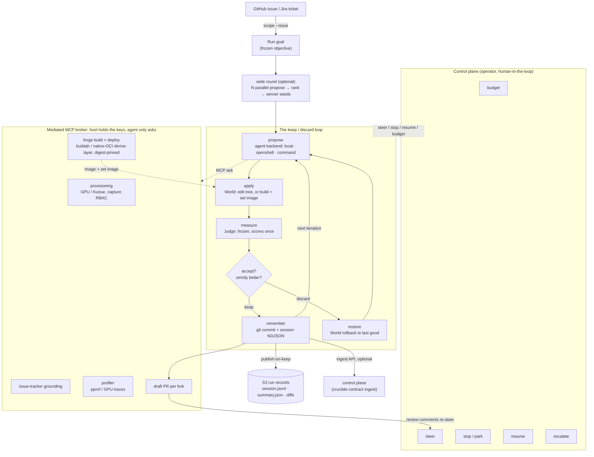

# How it works

The whole system in one diagram: a goal goes in, an agent proposes a change, the change is
applied to a reversible **world**, a **frozen judge** measures it once, and the loop keeps it
only if it strictly beats the best so far. Git is the memory; the operator can steer; the
privileged operations live host-side behind a mediated broker the agent can only *ask*.

The control shell around that loop, the gates between iterations and the ways a run ends, is
its own generated diagram: [Loop control states](./loop-states.md).

## The stages

| Stage | What happens | Deeper |
| --- | --- | --- |
| **Goal** | A GitHub issue or Jira ticket becomes a frozen run objective. The objective never moves once the run starts. | [ADR 0001](./adr/0001-adaptive-harness.md) |
| **wide round** | Optional: `--wide N` fans out N independent propose turns (one per `[search].approaches` entry) in parallel, ranks them by the gate, and the winner seeds the deep loop below. 0 (default) skips straight to propose. | [ADR 0010](./adr/0010-candidate-portfolios-and-search.md) |
| **propose** | The agent reads the history and edits the world toward the goal. The proposal policy is a pluggable backend (`local` / `openshell` / `command`), not the engine. | [What crucible is](./crucible.md) |
| **apply** | Make the candidate live. For a code repo the edits *are* the apply; for a deploy domain it builds + sets the image. | [ADR 0005](./adr/0005-engine-side-builds.md), [ADR 0012](./adr/0012-rendered-deployments.md) |
| **measure** | The frozen judge scores the candidate once. The agent is handed a `World`, never the `Judge`, so it can't tune the test it's graded on. | [ADR 0001](./adr/0001-adaptive-harness.md) |
| **accept?** | Keep iff `valid` and the score strictly beats the best per `direction`; otherwise restore the last good state. | [Contract](./crucible-contract.md) |
| **as a plan** | Every iteration runs as a work-graph plan (`propose -> apply -> measure -> decide`) through the shared executor; an authored workflow replaces the default graph. | [Work graphs](./work-graphs.md) |
| **remember** | Kept states are git commits; every step is an NDJSON session event. Git is the durable memory. Every run also emits exactly one `shutdown` event as its last line, so the viewer (and any published record) can tell a clean end from a pod that died mid-run. | [ADR 0004](./adr/0004-core-loop-state-model.md) |
| **broker** | Provisioning, issue-tracker grounding, the profiler, build/deploy, and draft PRs live host-side. The agent asks over MCP; the privilege never enters its sandbox. | [ADR 0002](./adr/0002-mediated-provisioning-mcp.md), [ADR 0006](./adr/0006-profiling-over-mcp.md) |
| **publish** | On keep, the run record ships to S3 and a draft PR per fork; authorized review comments re-steer the run. An optional private control plane can ingest run records over the `crucible-contract` HTTP API and render leaderboards and per-run pages; the loop never links it. | [Contract](./crucible-contract.md) |

## Glossary

The loop leans on a few overloaded words. The two that trip people up most are **World**
and **Judge**: they're the trust boundary, and they mean something specific here.

| Term | Plain English | What it actually is |
| --- | --- | --- |
| **World** | The workspace the agent is allowed to change. | The reversibly-mutable state: the code tree, and for a deploy domain the live deployment too. `GitWorld` / `CommandWorld`. The agent only ever touches the World. |
| **Judge** | The measurement script + the pass/win threshold. | The frozen objective: runs `measure`, gets `{valid, score, solved}`, and decides keep-or-discard per `direction`. `CommandJudge`. The agent never gets to touch it. |
| **Candidate** | The change being graded this iteration. | One proposed mutation of the World, applied and then measured once. |
| **measure / gate** | "Score this candidate." | The command that prints `{valid, score, solved?}`; nonzero exit = invalid. The Judge's scoring step. |
| **keep / discard** | Accept or reject. | Keep iff `valid` and the score strictly beats the best per `direction`; otherwise restore the last good state. |
| **direction** | Which way is "better." | `lower` (e.g. p99 latency) or `higher` (e.g. success rate). |
| **Agent / backend** | Who proposes the change. | The proposal policy that edits the World: `local` (in-process Claude), `openshell` (sandboxed), or `command`. Set by `[agent].backend`. |
| **snapshot / restore** | Save point and rollback. | An opaque token for the current World state, and rolling back to it. Defaults to a git ref + `git reset --hard`. |
| **Domain** | A problem packaged for the loop. | A `crucible.toml` manifest + a few executables (`measure`, optional `apply`/`snapshot`/`restore`). Mostly no Rust. |
| **Composite domain** | Several domains run as one. | A vector of component domains assembled into a single run (e.g. a router plus the model server it fronts), with one combined gate. |
| **Deployment** | The live test environment. | The cluster topology a deploy domain stands up to measure against. |
| **Broker** | The host-side keykeeper. | The mediated MCP service that holds all privilege (provisioning, issue-tracker access, profiler, build/deploy, draft PRs). The agent *asks*; the broker acts. |
| **forge** | The builder. | Engine-side image build + deploy: `buildah` for real source builds, native-OCI `derive_layer` for "base image + an edited file." |
| **publish-on-keep** | Ship a winner. | On a kept candidate, push the run record to S3 and open/update a draft PR per fork. |

For the prose version of the same model, see [What crucible is](./crucible.md).
