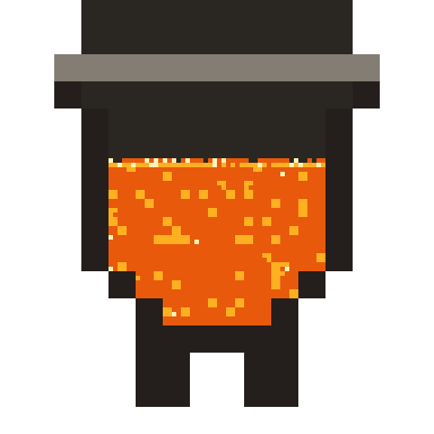

# crucible

  
    
    <canvas data-molten width="480" height="480" aria-label="The crucible mark, molten: lava sloshing in the vessel. Click to slosh."></canvas>
  
  
Agentic autoresearch loop

  
An agent forms a hypothesis, changes the code or config, measures once, and is gated keep-or-discard against a frozen objective. Git is the memory.

Crucible is a **goal-driven, gated, keep/discard loop** for letting an agent improve a
codebase against a frozen objective. Each iteration the agent reads the history, forms one
hypothesis, changes the world, and is gated on a single measurement: keep if better, else
revert. The loop itself is **domain-neutral**, it names nothing about any one problem.

A domain typically ships one or both of two gate shapes:

- **bench** (perf goals): replay a frozen workload against the candidate, minimize a
  latency or throughput metric. The first production domain measured an inference router
  GPU-free this way, via the [`vllm-vcr`](https://github.com/neuralmagic/vllm-vcr)
  workload simulator.
- **test** (bug-fix goals): run the affected packages' test suite; a green suite with a
  new regression test wins.

One domain need not mean one component. A **composite** domain assembles several component
domains into one deployment; a single agent turn can edit any component, and one combined
gate scores the assembled stack ([ADR 0009](./adr/0009-composite-domains.md)).

  
<strong>The shape:</strong> a domain is a <code>crucible.toml</code> manifest plus a few commands. The engine implements the loop; the domain satisfies the contract. A minimal fake domain (<code>examples/counter/</code>) exercises the whole thing end to end with no cluster and no LLM.

## The pieces

The `crucible` engine is a Cargo workspace; domain packs live in their own repositories
and are loaded via `--manifest`.

- **`crucible/`**: the domain-neutral engine binary: manifest load, the keep/discard loop,
  front-ends, resume, and `crucible deploy` (it renders its own loop/deployment manifests,
  [ADR 0012](./adr/0012-rendered-deployments.md)). The `World` + `Judge` traits are the
  domain boundary; a top-level `[composite]` manifest assembles several components into one run.
- **`forge/`**: engine-side build + deploy: buildah for real source builds, a native-OCI
  layer-append path (no container runtime), and a `kube-rs` client for apply/rollout.
- **`crucible-broker/`**: the mediated provisioning broker (the agent asks, the host holds
  the keys): GPU/trace capture, issue-tracker grounding, the profiler, and draft-PR
  publishing, all over MCP ([ADR 0002](./adr/0002-mediated-provisioning-mcp.md)). A domain
  may layer a thin per-domain binary on top of it.
- **`tools/*.nu`**: general control-plane glue installed as bare names on `PATH`
  (`steer`, `stop`, `escalate`, `session`, `goal-from-issue`).

## Where to go next

  

    <h3>Understand it</h3>
    
Read <a href="./crucible.html">What crucible is</a> for the whole system in one pass, concepts mapped onto the counter example.

  

  

    <h3>One domain, many parts</h3>
    
<a href="./adr/0009-composite-domains.html">Composite domains</a> assemble several components into one run, so the engine optimizes across component boundaries as well as within them.

  

  

    <h3>Build a domain</h3>
    
The <a href="./crucible-contract.html">implementation contract</a> is the frozen interface between the engine and a domain. It fixes what the engine implements and what a domain has to provide.

  

