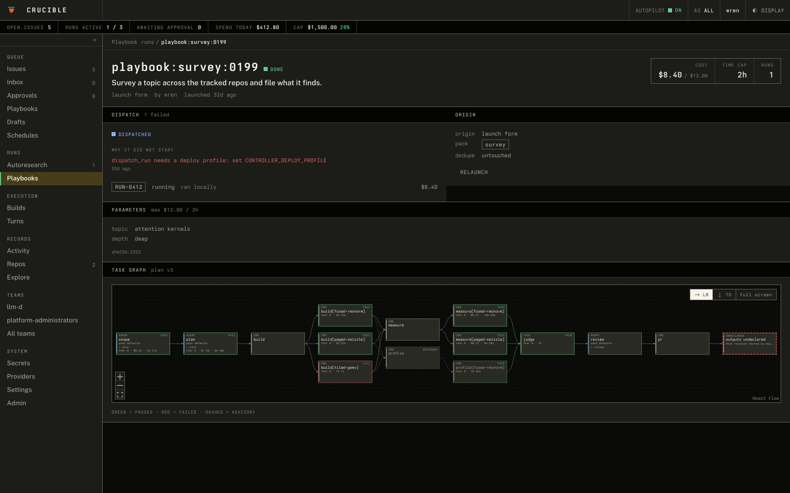

# crucible

<div class="cru-hero">
  <span class="cru-mark">
    
    <canvas data-molten width="480" height="480" aria-label="The crucible mark, molten: lava sloshing in the vessel. Click to slosh."></canvas>
  </span>
  <div>
    <p class="eyebrow">Deterministic agent orchestration</p>
    <p class="headline">Agents do the work. The engine decides what runs.</p>
    <p class="lead">Crucible is a deterministic orchestrator for agent workflows, with sandboxing built in. Declare the graph; the engine schedules it, contains it, and accounts for it.</p>
    <div class="cru-actions">
      <a class="cru-button primary" href="./playbooks.html">Write a playbook →</a>
      <a class="cru-button" href="./controller-local.html">Run the control plane</a>
      <a class="cru-button" href="https://github.com/neuralmagic/crucible">GitHub</a>
    </div>
  </div>
</div>

A workflow is a graph of agent turns, commands and checks. An agent never picks what runs
next: the executor does, by rules you can read before the run starts.

<div class="cru-lanes">
  <div class="cru-lane">
    <h3>Deterministic</h3>
    <p class="tag">The plan you review is the plan that runs</p>
    <ul>
      <li>Workflows compile to a static plan. Loops and functions unroll at compile time.</li>
      <li>The executor owns advancement. Dispatch order is stable and the event stream is reproducible.</li>
      <li>Outcomes follow fixed rules: transport failures retry, measured failures never do, and a plan that cannot run in full dispatches nothing.</li>
      <li>Cost and time ceilings are inputs to every run.</li>
    </ul>
  </div>
  <div class="cru-lane scored">
    <h3>Sandboxed</h3>
    <p class="tag">The host holds the keys</p>
    <ul>
      <li>Agent turns run in OpenShell sandboxes with deny-by-default egress.</li>
      <li>Privileged operations go through a mediated broker: the agent asks over MCP, the host acts.</li>
      <li>A pack declares its egress and credentials, and <code>crucible check</code> lists them before anything runs.</li>
      <li>Launch parameters reach prompts, never a command line.</li>
    </ul>
  </div>
</div>

## Two lanes

The same engine runs two kinds of workflow.

<div class="cru-grid">
  <a class="cru-card" href="./playbooks.html">
    <p class="cru-card-title">Playbooks <span class="arrow">→</span></p>
    <p>Run the graph once and ship what it produced, with a verdict on whether every required task held. Branches, review rounds and fan-out are decided at runtime, each bounded.</p>
  </a>
  <a class="cru-card" href="./how-it-works.html">
    <p class="cru-card-title">Autoresearch <span class="arrow">→</span></p>
    <p>Run the graph inside a keep-or-discard loop against a frozen judge. A change is kept only if it scores better than the best so far, and Git is the memory.</p>
  </a>
</div>

## A playbook, end to end

A pack is a directory: a `crucible.toml`, a `workflow.star`, and whatever scripts the tasks
run. This one reads a ticket, routes it to one queue, and files it:

```python
read = command(name = "read", run = "./classify.sh", emits = ["bucket"])

gate = route(
    name = "gate",
    depends_on = [read],
    source = read,
    questions = {
        "bucket": choice(
            ask = "Which queue owns this ticket?",
            options = ["outage", "billing", "feature"],
        ),
    },
)

oncall = command(name = "oncall", run = "./file.sh oncall", depends_on = [gate],
                 when = gate.bucket, answers = "outage")
finance = command(name = "finance", run = "./file.sh finance", depends_on = [gate],
                  when = gate.bucket, answers = "billing")
backlog = command(name = "backlog", run = "./file.sh backlog", depends_on = [gate],
                  when = gate.bucket, otherwise = True)

filed = command(name = "filed", run = "./file.sh filed",
                depends_on = [oncall, finance, backlog], join = "passed")

workflow(type = "playbook", tasks = [read, gate, oncall, finance, backlog, filed], result = filed)
```

```text
$ crucible plan run --manifest crucible.toml --max-cost 1 --max-time 5m
  read                 pass       attempts=1 cost=$0.0000  out={"bucket":"billing"}
  gate                 pass       attempts=1 cost=$0.0000  out={"bucket":{"confidence":1.0,"label":"billing",...}}
  oncall               not_taken  attempts=0 cost=$0.0000  (gate.bucket resolved to billing)
  finance              pass       attempts=1 cost=$0.0000  out={}
  backlog              not_taken  attempts=0 cost=$0.0000  (gate.bucket resolved to billing)
  filed                pass       attempts=1 cost=$0.0000  out={}
plan v1: completed — spent $0.0000 of $1
verdict: valid
```

The branches nobody chose settle `not_taken`: they never dispatch and spend nothing. Swap
`source = read` for `min_confidence = 0.8` and a decision model answers the question instead,
with low-confidence answers recorded as `uncertain`, which `otherwise` catches.

<figure class="cru-figure">
  
  <figcaption>A playbook run in the control plane: a fanned-out build and measure, one failed instance, an advisory profile, and each task's cost.</figcaption>
</figure>

## Where to go next

<div class="cru-grid">
  <a class="cru-card" href="./playbooks.html">
    <p class="cru-card-title">Your first playbook <span class="arrow">→</span></p>
    <p>Write a pack, run it with no model, then point it at a real agent.</p>
  </a>
  <a class="cru-card" href="./playbook-patterns.html">
    <p class="cru-card-title">Branching and review <span class="arrow">→</span></p>
    <p>Routes, revise loops, fan-out, sessions, joins and advisory tasks.</p>
  </a>
  <a class="cru-card" href="./dsl-reference.html">
    <p class="cru-card-title">DSL reference <span class="arrow">→</span></p>
    <p>Every constructor and argument, generated from the compiler.</p>
  </a>
  <a class="cru-card" href="./how-it-works.html">
    <p class="cru-card-title">The autoresearch loop <span class="arrow">→</span></p>
    <p>Propose, apply, measure, keep or discard, against a frozen judge.</p>
  </a>
  <a class="cru-card" href="./controller-local.html">
    <p class="cru-card-title">The control plane <span class="arrow">→</span></p>
    <p>A UI, API and CLI for launching and watching runs. Starts on a laptop with one command.</p>
  </a>
  <a class="cru-card" href="./crucible-contract.html">
    <p class="cru-card-title">The contract <span class="arrow">→</span></p>
    <p>The frozen interface between the engine and a domain.</p>
  </a>
</div>

## The pieces

| Crate | What it is |
| --- | --- |
| `crucible/` | The engine: the Starlark compiler, the plan executor, the autoresearch loop, agent backends, and `crucible deploy`. |
| `crucible-controller/` | The control plane: a Postgres ledger, the reconciling daemon, the HTTP API and the embedded UI. |
| `crux/` | The CLI and MCP tools over the controller API. |
| `crucible-broker/` | The mediated broker: the host holds the keys, the sandboxed agent asks over MCP. |
| `forge/` | Image builds, registry and deployment support. |
