# The loop state machine

<!-- Generated by `crucible loop-reference`; edit crucible/src/machine.rs instead. -->

The scored loop's decisions live in one I/O-free machine: the host performs effects and hands the results back, and the machine answers what happens next. Every edge below is a variant the compiler knows about, so this page cannot drift from the binary that drew it.

```mermaid
stateDiagram-v2
    [*] --> Head
    Head --> ApprovalPark: a block approval is pending
    ApprovalPark --> Head: granted: the re-scope drain re-baselines
    ApprovalPark --> escalated: denied with no fallback
    ApprovalPark --> stopped: stop while parked
    Head --> Head: an approved re-scope re-baselines a new segment
    Head --> Head: a denial noted; the frozen regime stands
    Head --> DistressPark: the agent raised distress(error)
    DistressPark --> Head: the operator cleared the marker
    DistressPark --> stopped: stop, or the park timed out
    Head --> stopped: interrupt at the head
    Head --> budget: a cost or time cap was reached
    Head --> finished: no iterations left
    Head --> Iteration: otherwise: run the turn
    Iteration --> Decide: decided: a measured candidate
    Decide --> Head: kept or discarded
    Decide --> solved: kept and solved, early stop on
    Decide --> budget: a cap was reached deciding
    Iteration --> Head: discarded, or parked for the next head
    Iteration --> Iteration: never-started: re-run, bounded
    Iteration --> stalled: consecutive dead turns hit the bound
    Iteration --> escalated: escalated by the agent
    Iteration --> stopped: stop at the post-turn checkpoint
    finished --> [*]
    solved --> [*]
    budget --> [*]
    stopped --> [*]
    escalated --> [*]
    stalled --> [*]
```

## How a run ends

The terminal states are the shutdown tokens the session log carries.

| Token | Meaning |
| --- | --- |
| `finished` | all iterations completed |
| `solved` | a kept candidate satisfied the win condition |
| `budget` | a cost or time cap was reached |
| `stopped` | stop signal received |
| `escalated` | the agent declared the harness inadequate — halted for human review |
| `stalled` | the run stalled on consecutive transport failures — no turn could start |