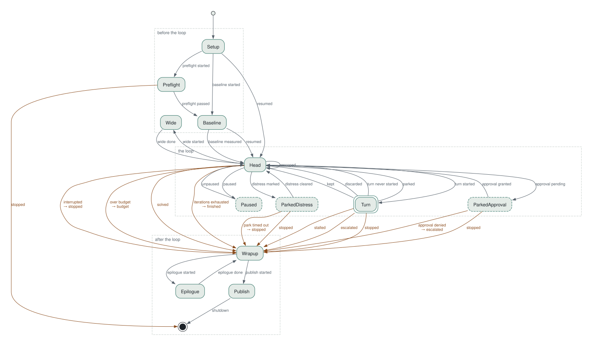

# Loop control states

Generated from `crucible/src/runloop/machine.rs` by `crucible loop-states`; `scripts/loop-docs.sh --check` keeps it current. The driver advances through this table at every gate, so an edge missing here is a transition the loop cannot take.

Each **Turn** is one iteration's work graph (propose → apply → measure → decide), rendered in [Work graphs](./work-graphs.md). Everything else is the control shell around it: the gates at the **Head**, the parks, and how a run ends. Dashed states are idle; the colored edges are the ways out.

The source is `docs/img/loop-states.dot` (`crucible loop-states --format dot`).

## How a run ends

The edge label after the arrow is the `shutdown` token on the session log.

| Token | Meaning |
|---|---|
| `finished` | all iterations completed |
| `solved` | a kept candidate satisfied the win condition |
| `budget` | a cost or time cap was reached |
| `stopped` | stop signal received |
| `escalated` | the agent declared the harness inadequate — halted for human review |
| `stalled` | the run stalled on consecutive transport failures — no turn could start |

An error inside the loop reports `error` and takes none of these edges.