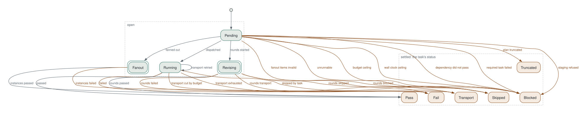
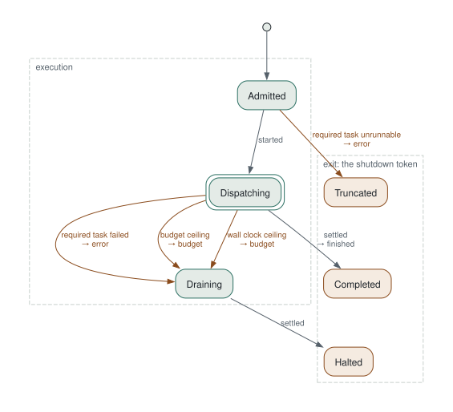

# Plan execution states

Generated from `crucible/src/plan/machine.rs` by `crucible plan states`; `scripts/state-docs.sh --check` keeps it current. The executor walks both tables at every decision, so an edge missing here is a path it cannot take. The graph itself, what the tasks are and how they depend on each other, is described in [Work graphs](./work-graphs.md); this page is how the executor walks one.

## One task

A task is pending until its dependencies settle, runs (retrying transport-class failures up to the configured count), and settles on one of the six statuses the session log reports. Everything that reaches a settled state without an attempt is a blocked task, and the edge names why.

## The plan

The plan dispatches ready tasks in topological order until every task has settled or a required task fails or a ceiling is reached. After a halt the remaining tasks settle as blocked; epilogue tasks still run after a required task fails so the failure is reported.

The sources are `docs/img/plan-task-states.dot` and `docs/img/plan-states.dot` (`crucible plan states --format dot`).

## Why a task is blocked

The note on a blocked task's result is one of these.

| Note | Meaning |
|---|---|
| `required task <task> failed` | A required task failed and the plan short-circuited before this one ran. |
| `budget ceiling reached` | The plan's spend reached its budget. |
| `wall-clock ceiling reached` | The plan's wall-clock limit passed. |
| `dependency did not pass` | A dependency settled without passing and the task's join needs it to. |
| `<the runner's reason>` | The runner could not stage the task's declared inputs. |

## How a plan ends

| State | Token | Meaning |
|---|---|---|
| Completed | `finished` | Every task settled; the plan is valid when every required task passed. |
| Halted | `error or budget` | A required task failed (`error`), or a budget or wall-clock ceiling was reached (`budget`); the rest drained as blocked. |
| Truncated | `error` | A required task cannot run on this substrate; nothing was dispatched. |