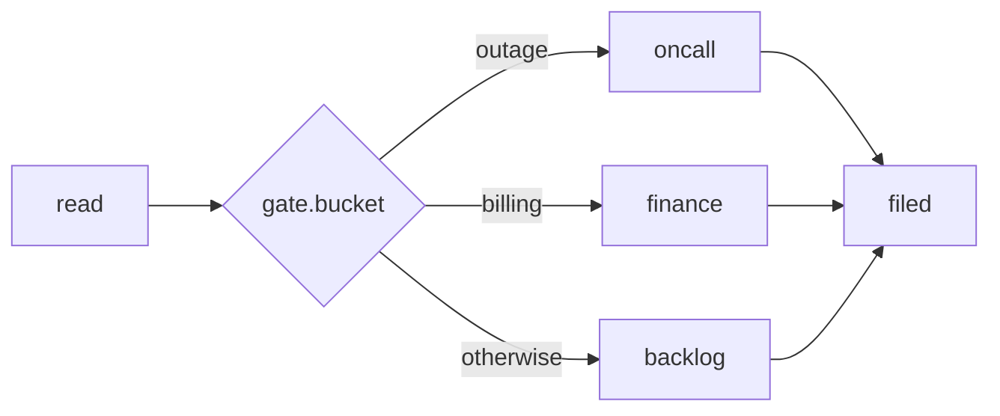

# Branching and review

The task set is fixed at compile time. Three constructs decide things at runtime, each one
bounded: `route()` picks branches, `revise` sends work back, and `over` fans out one instance
per item. This page covers those three, plus the smaller tools around them: sessions, gates,
joins, advisory tasks and reports.

Every argument is listed in the [DSL reference](./dsl-reference.md). What the executor does with
the result is in [Work graphs](./work-graphs.md).

## Branch on a decision

A `route()` asks typed questions about its dependencies' output and records one answer per
question. Downstream tasks name the answer they run on with `when`.



```python
read = command(name = "read", run = "./read.sh", emits = ["bucket"])

gate = route(
    name = "gate",
    depends_on = [read],
    source = read,
    questions = {
        "bucket": choice(
            ask = "Which queue owns this ticket?",
            options = ["outage", "billing", "feature"],
        ),
    },
)

oncall = command(name = "oncall", run = "./act.sh oncall", depends_on = [gate],
                 when = gate.bucket, answers = "outage")
finance = command(name = "finance", run = "./act.sh finance", depends_on = [gate],
                  when = gate.bucket, answers = "billing")
backlog = command(name = "backlog", run = "./act.sh backlog", depends_on = [gate],
                  when = gate.bucket, otherwise = True)

filed = command(name = "filed", run = "./act.sh filed",
                depends_on = [oncall, finance, backlog], join = "passed")
```

A branch whose answer did not come up settles `not_taken`. It never dispatches, spends
nothing, and does not affect the verdict. Anything that depends on it with the default
`join = "all"` is not taken either, which is why `filed` rejoins with `join = "passed"`.

**Who answers.** Exactly one of two:

| | Answered by | Cost |
| --- | --- | --- |
| `source = read` | A dependency's own output: `read` emits `{"bucket": "billing"}`. | Free and deterministic. |
| `min_confidence = 0.8` | A decision model, through the broker's `systemone` capability. An answer below the threshold is recorded as `"uncertain"`. | One model call per question. |

A source that emits a label the question does not declare fails the route, and the run
short-circuits there. A model-backed route with no decision binding truncates the plan
before anything spends.

**Question types.** `choice(ask, options)` is one of N labels, and `options` may be a dict
whose values describe each label for the model. `noul(ask)` answers `"yes"` or `"no"`, and
`when = gate.urgent` with no `answers` runs on `"yes"`.

**Every answer goes somewhere.** The compiler refuses a route where some answer a `when`
could see, `"uncertain"` included, reaches no task. Cover the rest with `otherwise = True`,
or say an answer deliberately leads nowhere with `drop`:

```python
"urgent": noul(ask = "Does the customer need a reply within the hour?", drop = ["no", "uncertain"]),
```

Adding an option to a question can therefore never strand a ticket silently: `otherwise`
catches it, or the pack stops compiling until the new label has a home. `examples/route` is
the full pack, with a model-backed gate and a serving recipe for the decision model.

## Send work back

A task with `revise = <dependency>` is a reviewer. When it settles failing and rounds remain,
the dependency runs again with the verdict, and then the reviewer does.

```python
author = agent(
    name = "author",
    prompt = "Write PROBE.md, a probe that demonstrates the reported bug.",
    session = "author",
    emits_files = ["PROBE.md"],
)

review = command(
    name = "review",
    run = "./check.sh",
    depends_on = [author],
    emits_files = ["evidence/review.json"],
    revise = author,
    max_rounds = 3,
)
```

From the second round, the author's inputs carry the reviewer's last verdict under
`revision`, and the reviewer's declared files are staged under `inputs/review/`:

```json
{"round": 2, "max_rounds": 3, "reviewer": "review",
 "review": {"status": "fail", "note": "exit 1: ", "files": true,
            "output": {"accepted": false, "why": "the probe hit an unrelated 400"}}}
```

- **Rounds are bounded.** `max_rounds` is 2 to 5 and has no default.
- **Each round settles.** A passing round commits, a failing one is discarded, and the
  session log records `author[round-1]`, `review[round-1]` and so on. The rows that gate the
  verdict are the last round's.
- **Sessions resume.** An author with a `session` continues the same conversation each round,
  so it remembers what it already tried.
- **One pair, one loop.** The target must be a direct dependency. No fan-out on either side,
  no two reviewers for one target, no nested or chained loops.

`examples/revise-loop` runs a revise pair through a real OpenShell sandbox with a fake model.

## Fan out

`over = producer.field` maps a task over a list its dependency emits, one instance per item:

```python
scan = skill(
    name = "scan",
    skill = "skills/scan-issues",
    args = {"repo": param("repo")},
    emits = ["issues"],
)

triage = skill(
    name = "triage",
    skill = "skills/triage-issue",
    depends_on = [scan],
    over = scan.issues,
    max_fanout = 12,
    isolated = True,
    required = False,
    emits = ["classification", "severity"],
    emits_files = ["TRIAGE.md"],
)

roundup = command(
    name = "roundup",
    run = "python3 roundup.py",
    depends_on = [scan, triage],
    join = "passed",
    emits_files = ["REPORT.md"],
)
```

Instances are keyed by item, so `triage[123]` is issue 123 on every retry and in every report
row, and an instance reads its own key from the reserved `item` input. `max_fanout` caps the
count within the engine's ceiling of 256. `isolated = True` runs the instances concurrently in
private worktrees; `required = False` lets a sweep finish with some instances failed; and
`join = "passed"` hands `roundup` only the ones that passed. `examples/triage` is the full pack.

When the list is known at compile time, write the fan-out in Starlark instead. It unrolls
into ordinary tasks:

```python
AUDITS = [("headings", True), ("bullets", True), ("freshness", False)]

def auditor(topic, blocking):
    return agent(
        name = "audit-" + topic,
        prompt = prompt_file("prompts/audit.md") + "\nAUDIT: " + topic.upper() + "\n",
        depends_on = [polish],
        isolated = True,
        required = blocking,
        emits = ["findings"],
    )

auditors = [auditor(topic, blocking) for topic, blocking in AUDITS]
```

## Keep a conversation

Agent tasks that share a `session` continue one conversation, in dependency order:

```python
scribe = session(name = "scribe")

draft = agent(name = "draft", prompt = prompt_file("prompts/draft.md"), session = scribe, emits = ["entries"])
shape = command(name = "shape", run = "./shape.sh", depends_on = [draft])
polish = agent(name = "polish", prompt = prompt_file("prompts/polish.md"), session = scribe, depends_on = [shape])
```

`polish` picks up where `draft` left off. Every pair of tasks in a session needs a dependency
path between them, and a session task cannot be isolated. `session()` can also set the
harness, model and effort its tasks default to.

`shape` sitting between the two turns is the other pattern here: **a command as a gate**. It
reads `draft`'s declared `entries` from `CRUCIBLE_INPUTS`, counts what is on disk, and exits
nonzero on a mismatch, so a bad draft never pays for a second turn.

## Joins

A task's `join` says what it needs from its dependencies before it runs:

| `join` | Runs when | Receives |
| --- | --- | --- |
| `all` (default) | Every dependency passed. | Every dependency's output. |
| `passed` | Every dependency is terminal and at least one passed. | Only the passing ones. |
| `settled` | Every dependency is terminal, whatever it settled as. | Each one as `{status, note, output, files}`. |

`passed` is for rejoining branches and folding fan-outs. `settled` is for a task that has to
see failures, such as a summary that reports what broke.

## Advisory tasks

`required = False` makes a task advisory. When it fails, its dependents are blocked, but the
run can still be valid. Use it for checks worth running that should not sink the result: a
freshness audit, a slow benchmark, one instance of a sweep.

The inverse matters too. A `required` task that cannot run on this substrate, because its
`needs` capability is not declared, truncates the whole plan before anything dispatches. A
graph missing a required piece cannot produce an honest pass, so it does not try.

## Report the result

`report()` is an engine-owned task that publishes a rendered template to a destination the
controller configures:

```python
publish = report(
    name = "publish-report",
    destination = {"kind": "slack"},
    template = "reports/slack.md.j2",
    result = roundup,
    required = True,
)
```

The workflow names a destination key, never a URL, channel or credential. `result` projects
only that task's declared fields into the message. No agent can skip the call or write the
payload.

## Where to look next

<div class="cru-grid">
  <a class="cru-card" href="./dsl-reference.html">
    <p class="cru-card-title">DSL reference <span class="arrow">→</span></p>
    <p>Every constructor, its lane, and its arguments.</p>
  </a>
  <a class="cru-card" href="./work-graphs.html">
    <p class="cru-card-title">Work graphs <span class="arrow">→</span></p>
    <p>Readiness, retries, budget, isolation and the plan file format.</p>
  </a>
  <a class="cru-card" href="./plan-states.html">
    <p class="cru-card-title">Plan states <span class="arrow">→</span></p>
    <p>The state machine every task and plan moves through.</p>
  </a>
</div>
