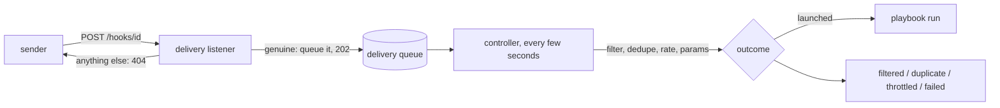

# Launching from webhooks

A webhook launches a registered playbook when a sender outside the controller posts a delivery.
The sender can be anything that POSTs JSON to a URL: quay.io after an image push, GitHub after a
release, a CI job, or your own script. The controller checks the delivery
is genuine and queues it. Within a few seconds it takes the delivery off the queue and runs a small
CEL transform that decides whether it launches, which event it is, and what params the launch
gets.



The listener never launches anything itself. It answers `202` once the delivery is queued. The
controller then works through each webhook's queue in the order deliveries arrived, and gives each
one exactly one outcome you can read back.

## Verifiers

A webhook proves each delivery with one of two verifiers, chosen when it is created and fixed after
that. To switch, delete the webhook and create another.

| Verifier | Sender | What a delivery carries |
| --- | --- | --- |
| `path_token` | Any sender: quay.io, GitLab, a CI job, `curl` | The secret as the last path segment: `/hooks/<id>/<token>` |
| `hmac_sha256` | GitHub, or any sender that signs the same way | `sha256=` and the lowercase hex HMAC-SHA256 of the raw body, in the header you name (`x-hub-signature-256`) |

A sender that signs some other way (a base64 signature, or a signature over a timestamp and the
body) cannot use `hmac_sha256`. Give it a `path_token` URL instead; the token is the credential.

The controller generates every secret (256 random bits) and shows it once, in the response that
created or rotated it. Path tokens are stored as SHA-256 digests. HMAC secrets are sealed with
AES-256-GCM under the webhook key; a controller without one refuses `hmac_sha256` webhooks.

A delivery that is not recorded, for any reason, gets the same answer: `404` with
`{"error":"not found"}`. That covers an unknown or deleted webhook, a paused one, a wrong token or
signature, and a body over 512 KiB. Webhook ids are random UUIDs, so the address alone reveals
nothing.

## Creating a webhook

### From the UI

Open a playbook and choose **Add webhook**. **Sender** starts on **Custom**, for any sender that
POSTs JSON: the filter launches every delivery, the dedupe key is `delivery`, and every param is
fixed until you derive it. The named senders (quay.io repository push, GitHub release, GitHub push)
fill the verifier, the transform, and the params they can match by name; switching back to
**Custom** starts the transform over. For each param the playbook
declares, choose **fixed value** or **derived (CEL)**. Expressions are checked as you type and
marked where they fail. **Run preview** evaluates the transform on a sample body and headers
without storing anything.

Saving shows the delivery URL and the secret once. Configure the sender with them:

- **Any sender:** POST JSON to the delivery URL (it includes the token). See
  [A custom sender](#a-custom-sender).
- **quay.io:** repository settings, **Create Notification**, event *Push to Repository*,
  method *Webhook POST*, URL = the delivery URL.
- **GitHub:** repository settings, **Webhooks**, **Add webhook**, payload URL = the delivery URL,
  content type `application/json`, secret = the HMAC secret, then choose the events.

**Webhooks** in the navigation lists every webhook you can read. A webhook's page shows its
delivery URL, its transform, the pause/resume, rotate, and delete controls, and its delivery log.
**Edit** reopens the form, and its preview can load any recorded delivery as the sample.

### A custom sender

Anything that can send an HTTP POST with a JSON body works with a `path_token` webhook:

```sh
curl -X POST -H 'content-type: application/json' \
  -d '{"service": "api", "version": "1.4.2", "env": "staging"}' \
  "$DELIVERY_URL"
```

The body is yours to shape. Write the transform against it: a filter such as
`body.env == "staging"`, a dedupe key such as `body.service + "@" + body.version` so a retried
POST launches once, and a derive for each param (`version: body.version`). Load a recorded delivery
into the edit form's preview to try the transform on what the sender actually posted. Keys a sender
sometimes omits need a guard: `has(body.env) && body.env == "staging"`.

An `hmac_sha256` sender also signs the raw body, in the header the webhook was created with
(`x-signature` here):

```sh
body='{"service": "api", "version": "1.4.2"}'
sig=$(printf '%s' "$body" | openssl dgst -sha256 -hmac "$SECRET" -hex | sed 's/^.* //')
curl -X POST -H 'content-type: application/json' -H "x-signature: sha256=$sig" \
  -d "$body" "$DELIVERY_URL"
```

The body must be JSON; anything else is recorded and ends `failed`.

### From crux

```sh
crux webhook-presets                    # starting points, as JSON
crux webhook-check --file hook.json     # CEL diagnostics, field:line:col; fails on any
crux webhook-create --file hook.json    # prints the webhook, its secret, and delivery URL, once
crux webhooks                           # list
crux webhook <id>                       # one, as JSON
crux webhook-deliveries <id> [--before <delivery-id>] [--limit N]
crux webhook-update <id> --file hook.json
crux webhook-pause <id>                 # its address answers 404; queued deliveries fail
crux webhook-resume <id>
crux webhook-rotate <id>                # new secret, shown once; the old one stops working
crux webhook-delete <id>
crux webhook-preview --file preview.json
```

A create body:

```json
{
  "playbook": "on-image-push",
  "verifier": "path_token",
  "filter": "\"latest\" in body.updated_tags",
  "dedupe": "delivery",
  "derive": { "image": "body.docker_url", "tags": "body.updated_tags" },
  "params": { "release": "3.2" },
  "max_launches_per_hour": 10,
  "retention_days": 14,
  "max_cost": 5,
  "max_time": "30m"
}
```

`params` are fixed values, validated against the playbook's schema like a launch form. `derive`
maps a declared param to the expression that derives it; a param may be fixed or derived, not
both. An `hmac_sha256` body also names `"header": "x-hub-signature-256"`.

### From the API

`POST /api/webhooks`, `GET /api/webhooks`, `GET|PUT|DELETE /api/webhooks/{id}`,
`POST /api/webhooks/{id}/enabled`, `POST /api/webhooks/{id}/secret`,
`GET /api/webhooks/{id}/deliveries?before=&limit=`, `POST /api/webhooks/preview`,
`POST /api/webhooks/check`, `GET /api/webhooks/cel`, `GET /api/webhooks/presets`. The schemas are
in `/api/openapi.json`. Webhooks are standing launches for authorization: reading one takes `read`
on it, changing one takes `update`, and a save that changes what it launches is also decided as a
launch of the playbook.

## The transform

Three kinds of CEL expression, each over the same variables:

| Variable | Value |
| --- | --- |
| `body` | The delivery's JSON body. Integers are `int`, other numbers `double`. |
| `headers` | The recorded headers, names lowercased: `headers["x-github-event"]`. |
| `delivery` | The delivery's id, unique per delivery. |
| `received_at` | When it arrived, RFC 3339. |

- **`filter`** is a bool. A delivery it rejects ends `filtered`. Absent means `true`.
- **`dedupe`** is a string or int, at most 512 bytes. A delivery whose key already launched ends
  `duplicate`, for as long as the webhook exists, even after the delivery that used it is pruned.
  `delivery` makes every delivery its own event.
- **`derive.<param>`** yields a string, number, bool, or list of strings for that param.

Functions: `size`, `int`, `uint`, `double`, `string`, `bytes`, `type`, `timestamp`, `duration`,
and on a target `contains`, `startsWith`, `endsWith`, `matches`. Macros: `has`, `all`, `exists`,
`exists_one`, `map`, `filter`. `GET /api/webhooks/cel` returns the same lists; there is no `join`.

A save is refused, with the field and where the parser can say the line and column, when an
expression:

- does not parse, or nests brackets more than 32 deep, or is longer than 2 KiB;
- reads a variable other than the four above, or calls a function CEL here does not define;
- nests comprehensions more than two deep;
- has a comprehension whose condition or step reads anything but its own variables
  (`body.l.map(x, body.l)` is refused; `body.items.exists(i, i.tags.exists(t, t == "x"))` is
  allowed). This is what keeps evaluation linear in the body.

### Examples

quay.io push of a release tag:

```text
filter  body.updated_tags.exists(t, t.matches("^v[0-9]+"))
dedupe  delivery
image   body.docker_url + ":" + body.updated_tags.filter(t, t.matches("^v"))[0]
```

GitHub release:

```text
filter  headers["x-github-event"] == "release" && body.action == "published"
dedupe  string(body.release.id)
tag     body.release.tag_name
```

quay.io's push payload names the pushed tags and no digest, so the quay preset dedupes on
`delivery`: every push launches. The rate limit is what stops a playbook that pushes the image it
listens to from launching itself in a loop.

## Outcomes

A delivery shows `queued` until the controller gets to it, a few seconds at most. Deliveries are
handled in the order they arrived, and each stops at the first step that decides it:

| Step | Outcome |
| --- | --- |
| The body is not JSON | `failed` |
| The filter is false, or fails | `filtered`, or `failed` |
| The dedupe key cannot be derived | `failed` |
| The key already launched | `duplicate` |
| The hour's launches reached `max_launches_per_hour` | `throttled` (never retried) |
| A param cannot be derived, or the schema refuses it, or the launch is denied | `failed` |
| Otherwise | `launched`, with the launch key |

Failures a delivery causes do not count toward disabling the webhook. Failures of the launch itself
(the playbook is gone, its stored params no longer fit its schema, the policy denies it) do, and a
webhook that fails `CONTROLLER_SCHEDULE_AUTO_DISABLE_FAILURES` times in a row (the threshold
schedules and watches share) pauses itself. Pausing or deleting a webhook fails its queued
deliveries. Finished deliveries are kept for
`retention_days` (1 to 90, default 14); `max_launches_per_hour` is 1 to 120.

A delivery's body and headers are readable by anyone who can read the webhook; a header that can
carry a credential (`authorization`, `cookie`, the signature header) is never recorded.

## Deploying

| Variable | Meaning |
| --- | --- |
| `CONTROLLER_HOOKS_ADDR` | `host:port` the delivery listener binds. Unset serves no listener. |
| `CONTROLLER_HOOKS_PUBLIC_URL` | The listener's public base URL; delivery URLs are built on it. Unset returns only the path. |
| `CONTROLLER_WEBHOOK_KEY_FILE` or `CONTROLLER_WEBHOOK_KEY` | Base64 AES-256 keys, newest first, that seal `hmac_sha256` secrets. Unset refuses `hmac_sha256` webhooks. |

The listener is a separate port from the API, so a deployment can publish it alone. In the Helm
chart, `webhooks.enabled` adds the `hooks` container and Service port and a Route on the external
host for the `/hooks` path only, and `webhooks.key.existingSecret` mounts the webhook key. The
webhook key is independent of `CONTROLLER_CREDENTIAL_KEY`, which also turns on offline credentials
at sign-in.

Generate a key with `head -c 32 /dev/urandom | base64`. To rotate, put the new key first and keep
the old one after it until every secret sealed under it has been rotated.

## Trying it locally

`just controller-local` serves the delivery listener on `127.0.0.1:8871` (`HOOKS_PORT` overrides)
and generates a webhook key once in its state directory. A command-only pack exercises webhooks
with no agent:

```sh
mkdir -p /tmp/image-pushed && cd /tmp/image-pushed
cat > crucible.toml <<'EOF'
[workspace]
inject = ["announce.sh"]

[agent]
backend = "command"
agent_cmd = "true"
goal = "Record which image a registry push named."

[workflow]
type = "playbook"
file = "workflow.star"
EOF
cat > workflow.star <<'EOF'
params = {
    "image": {"type": "string", "required": True, "pattern": "^quay\\.io/"},
    "tags": {"type": "list<string>", "default": ["latest"]},
}

announce = command(name = "announce", run = "./announce.sh")

workflow(type = "playbook", tasks = [announce], result = announce)
EOF
printf '#!/bin/sh\necho "$CRUCIBLE_INPUTS"\n' > announce.sh && chmod +x announce.sh

crux draft-create image-pushed --description "Record which image a registry push named"
crux draft-push image-pushed /tmp/image-pushed --base-version 1
crux draft-publish image-pushed --playbook on-image-push
```

Create a quay webhook for `on-image-push` (the body above, or the UI), then post a push the way
quay.io would, with the `delivery_url` the create printed:

```sh
curl -X POST --data '{"repository":"org/img","docker_url":"quay.io/org/img","updated_tags":["latest"]}' \
  "$DELIVERY_URL"
crux webhook-deliveries <id>
```

The delivery is processed within a few seconds (`POST /api/reconcile` makes it immediate). A GitHub-shaped delivery
to an `hmac_sha256` webhook signs its body:

```sh
sig="sha256=$(printf '%s' "$BODY" | openssl dgst -sha256 -hmac "$SECRET" | awk '{print $NF}')"
curl -X POST -H "X-GitHub-Event: release" -H "X-Hub-Signature-256: $sig" --data "$BODY" "$DELIVERY_URL"
```

## Troubleshooting

| Symptom | Cause |
| --- | --- |
| The sender sees `404` | Wrong id or token, a changed or rotated secret, a paused webhook, a signature over a different body, or a body over 512 KiB. |
| The sender sees `503` | The controller could not record the delivery, or is shedding load; the sender retries. |
| `filtered` | The filter was false. Load the delivery into the edit form's preview to see why. |
| Stays `queued` | The webhook's owner has to sign in again, or the controller is not running its launch loop. |
| `failed` with `no key "x"` | An expression read a key this payload does not have. Guard a field with `has(body.x)` and a header with `"x" in headers`, before the part that reads it. |
| `duplicate` | The dedupe key already launched. Use `delivery` if every delivery is its own event. |
| `hmac_sha256` refused on save | The controller has no webhook key. |

The design is [ADR-0055](https://github.com/neuralmagic/crucible/blob/main/gov/adr/ADR-0055-webhook-triggers-verified-deliveries-land-in-an-inbox-and-cel-maps-them-to-a-launch.toml);
the obligations are RFC-0003's webhook clauses in [RFC-0003](./rfc/RFC-0003.md).
