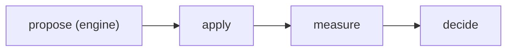

# Work graphs

A **plan** is a versioned DAG of **tasks** that a deterministic executor runs. Tasks are agent
turns, plan-authored commands, or engine-owned reducers. The executor owns advancement: a task never
decides what runs next.

Today, the engine supplies a default loop graph and a wide-tournament template, and a human or
pack can supply TOML or JSON through the `plan` CLI. Workflow admission separates authorable
topology from authority: an orchestrator must advertise the workflow type and engine operations
it can safely execute.

## Running a plan

```sh
# compile and print it, without executing
crucible plan show --file plan.toml
crucible plan show --file plan.toml --mermaid      # flowchart source
crucible plan show --file plan.toml --render       # PNG, inline if the terminal supports it

# execute: command tasks run as subprocesses, agent tasks through the real harness
crucible plan run --file plan.toml --manifest crucible.toml

# execute without a manifest: agent tasks run a stand-in command instead
crucible plan run --file plan.toml --agent-cmd ./role.sh

# replace the manifest's [agent] harness and model for this run; a task that pins its own keeps it
crucible plan run --manifest crucible.toml --harness codex --model gpt-5.6-luna
```

`--cap <name>` (repeatable) declares what the substrate can do; see *needs* below.

`plan run` exits nonzero when the plan does not reach a valid verdict.

## File format

```toml
version = 1                 # the only format version accepted today
# reason = "..."            # reserved for a future replan protocol

[budget]
usd = 5.0                   # required, positive; execution fails closed on overrun

[params]                    # optional; command and evaluate tasks read it as inputs["params"]
topic = "slag"

[[task]]
name = "propose"            # unique within the plan
kind = "agent"
prompt = "..."
model = "claude-opus-4-6"   # optional per-task overrides of the manifest's [agent]
harness = "claude"
effort = "high"
session = "solver"         # optional durable logical conversation

[[task]]
name = "measure"
kind = "command"
command = "./bench.sh"
depends_on = ["propose"]
needs = "gpu"               # default "any"
required = true             # default true
isolation = "worktree"      # optional
join = "all"                # default "all"
emits = ["score"]           # optional declared output fields; absent = undeclared
                            # or typed: emits = { score = "number", tier = ["high", "low"] }
timeout = "20m"             # optional per-attempt limit; agent, command, and evaluate only

[[task]]
name = "pick"
kind = "top_k"
k = 1
direction = "lower"         # or "higher"
depends_on = ["measure"]
```

### Task kinds

| Kind | What it runs |
| --- | --- |
| `agent` | One agent turn. `harness` / `model` / `effort` override the manifest's `[agent]` defaults per task; `session` opts into durable continuation. |
| `command` | A plan-authored command returning JSON on its last stdout line. |
| `evaluate` | A measurement command. `pass = false` vetoes; paired `threshold` + `direction` grade numeric `score`. |
| `top_k` | Engine-owned reducer: keep the `k` best inputs by their `score` field. Needs at least one dependency. |
| `engine` | Capability-owned operation (`propose`, `apply`, `measure`, `grade`, `decide`, or `measure_diff`). Only an admitting orchestrator can execute it. |

Serialization is not authority. A workflow may author and sequence engine nodes, but admission
requires matching capabilities such as `workflow.autoresearch`, `engine.apply`, and
`engine.measure`. The generic plan runner rejects them because it owns neither a `World` nor a
frozen `Judge`.

A command string is not a trust boundary by itself. If it invokes a script that must remain
trusted after an agent task edits the workspace, declare that script as a frozen
`[[workspace.inject]]` in the manifest. The plan runner restores frozen injects in the task's
actual workspace before every task, including isolated worktrees.

A logical `session` is serial state, so every pair of tasks sharing one must have a dependency
path between them. A session task cannot use disposable worktree isolation. The private ledger keeps
only an opaque harness cursor and completed-turn count; neither that cursor nor Claude's native
transcript is copied into the plan or public session log. Normal streamed harness events retain
their existing visibility. Claude Code's native transcript remains in its private local store or a
mode-0600 engine store restored into each fresh OpenShell sandbox. Omit the field for the historical
fresh-turn behavior.

### Task output

A task's output is JSON and becomes its dependents' input.

- `command`: the last non-empty stdout line. Nonzero exit is a measured failure; a spawn
  failure is a transport failure. Upstream outputs arrive as a JSON object keyed by task name,
  in the file `CRUCIBLE_INPUTS_FILE` names, plus `CRUCIBLE_TASK`. The same JSON is also in
  `CRUCIBLE_INPUTS` while it is at most 64 KiB; past that the variable is unset, because Linux
  refuses an environment string over 128 KiB. Read the file.
- `agent` under `--manifest`: the turn writes a single JSON object to `PLAN_TASK_RESULT.json`
  in the workspace root. A missing file after a normal turn is a measured failure; an explicit
  spawn, harness, or stream error is a transport failure and follows the retry policy.
- `agent` under `--agent-cmd`: the stand-in receives `CRUCIBLE_PROMPT`, `CRUCIBLE_HARNESS`,
  `CRUCIBLE_MODEL`, `CRUCIBLE_EFFORT`, and returns JSON on its last stdout line.
- `evaluate`: requires a JSON object. `pass = false` fails and malformed `pass` fails closed.
  Paired `threshold` and `direction` compare numeric `score` (`lower` is `<=`; `higher` is `>=`).
  Without a threshold, a successful command passes unless `pass` is false.

`top_k` reads a finite numeric `score` from each input, so an upstream task that wants to rank
must emit one. That contract is declarable: `emits = ["score"]` on an `agent`, `command`, or
`evaluate` task names fields its JSON output promises to include. Validation rejects a `top_k`
dependency, `grade` score source or tiebreak, or thresholded `evaluate` whose declared emits omits
`score`, before anything runs; at runtime a passing attempt missing a declared field is converted
to a measured failure at the producing task (never retried, blocks dependents), so output drift
fails where it happened instead of downstream. An empty or absent `emits` declares nothing and is
never checked. `top_k` and `engine` tasks cannot declare emits; their outputs are
engine-defined.

`emits` can also promise each field's type, as a dict from field name to type:

```python
scan = command(
    name = "scan",
    run = "./scan.sh",
    emits = {"targets": "list", "count": "integer", "severity": ["high", "low"]},
)
```

A type is `"string"`, `"integer"` (a number with no fractional part), `"number"`, `"boolean"`,
`"list"`, `"object"`, or a list of labels, which declares a string equal to one of them. Labels
are identifiers, like route labels. The list form keeps working and promises presence only.

At runtime a passing attempt whose field holds the wrong type, or a string outside its labels,
is a measured failure at the producing task, the same as a missing field, and the note names
the field, what arrived, and what was declared. A task that settled itself skipped or failed
owes nothing.

At compile time the types are checked wherever the graph reads a field, before any spend:

- `over = scan.targets` needs a field declared `"list"`, reported at the `over` argument.
- A `top_k` dependency, a `grade` score source or tiebreak, and a thresholded `evaluate` need
  `score` declared `"number"` or `"integer"`.
- `route(source = scan, ...)` needs each question's field declared as labels the question
  answers (its options, or `yes`/`no`, plus `uncertain`), or `"boolean"` for a `noul`. A
  `"string"` is refused: it promises nothing about which label arrives.

A field declared without a type (list form) or a task with no `emits` stays unchecked at compile
time. The generated TOML carries the types as a table (`emits = { score = "number" }`) and the
`plan_admitted` event lists each field with its type.

### Schema types

`schema_file(path)` reads a JSON Schema (draft 2020-12) from the pack and stands in for a type,
in `emits` and in a dict form of `emits_files`:

```python
plan = command(
    name = "plan",
    run = "./plan.sh",
    emits = {"lanes": schema_file("crucible/schemas/lanes.json"), "tickets": "integer"},
    emits_files = {"RESULT.json": schema_file("crucible/schemas/result.json"), "REPORT.md": None},
)
```

The schema's content is compiled into the plan, so editing it changes the plan digest. A file
that is not a valid 2020-12 schema, declares another `$schema`, or references a remote `$ref` is
a compile error at the call; nothing is fetched. At runtime a passing output whose field the
schema rejects, or a declared file that is not JSON or does not match, fails the producing task
like a wrong type, with a note giving the first three errors as instance path and message:
`output field "lanes" does not match its schema: /1: value is not of type "string"`. Notes never
repeat the refused value.

Each consumer checks the schema exactly, reading `type`, `const`, `enum`, local `$ref`, `allOf`,
and every branch of `anyOf`/`oneOf`, and refusing what it cannot prove:

- `over` needs `"type": "array"` whose `items` (and any `prefixItems`) are provably strings:
  `"type": "string"`, or a `const`/`enum` of strings. A mapped instance is named by its item, so
  `{"type": "array"}` with no `items`, or `"items": {"type": "integer"}`, is a compile error at the
  `over` argument.
- A score needs a numeric `type`, and its `const`/`enum` must hold numbers only.
- A `route(source = ...)` question needs every value the schema bounds (`const`, `enum`, or
  `"type": "boolean"`, which answers `yes`/`no`) to be a label the question accepts. A schema that
  bounds nothing is refused, as `"string"` is.

When a route's source bounds a question to finitely many answers, by a label list, `"boolean"`, or
a schema, a `when` naming a label the source can never give is a compile error ("can never be
answered"), such a label needs no task, and `otherwise` covers only the labels it can give. A schema
with no single top-level type satisfies no consumer. On the wire a schema is its JSON text (`{ schema = "..." }` in the TOML,
`{ path = "RESULT.json", schema = "..." }` for a file), since TOML cannot hold the nulls schemas
often carry.

### Repair

An agent task can fix its own output instead of failing on it:

```python
plan = agent(
    name = "plan",
    prompt = prompt_file("prompts/plan.md"),
    emits = {"lanes": schema_file("crucible/schemas/lanes.json")},
    emits_files = {"RESULT.json": schema_file("crucible/schemas/result.json")},
    repair = 2,
)
```

When a turn passes but its output misses a declared field or file, or breaks a type or schema,
the engine resumes the same conversation with the validation notes (masked as above) and asks for
the output and files to be fixed in place, then checks again, up to `repair` times (at most 3).
Repairs run within the attempt's `timeout`, cost what they cost against the run's budget, and do
not start once the attempt has spent what the run had left. They are not retries: `attempts`
stays 1, and when repairs run out the task fails with the note it would have failed with anyway.
Each mapped instance repairs on its own. A task with no `session` gets a conversation for the
attempt; one in a session continues it. `command` and `evaluate` refuse `repair`.

Each repair is recorded on the task's `task_result` event under `repairs`, as
`{label, round, of, cost_usd, notes}` with labels like `audit[RHAI-1] repair 1/2`.

## Execution semantics

How the executor walks a graph, what one task goes through and how the plan as a whole
ends, is its own generated diagram: [Plan execution states](./plan-states.md).

**Readiness.** A task dispatches when its dependencies are terminal and its join is satisfied.
Dispatch order is declaration-stable, so the event stream is deterministic.

**Truncation is fail-closed.** If a `required` task can never run on this substrate (its
`needs` is not in the declared caps, or a dependency cannot run), the whole plan is truncated
and *nothing* is dispatched. A truncated DAG cannot produce an honest pass. An advisory task
in the same position is skipped, along with its dependents, and validity is unaffected.

**Failure.** A `required` task that fails short-circuits the plan; everything undispatched is
blocked. An advisory failure blocks only its dependents.

**Early completion.** In a playbook, a passing main-graph task that returns `"complete": true`
(with an optional `"reason"` string) ends the run: nothing else in the main graph dispatches,
undispatched tasks stay unsettled rather than blocked, and epilogue tasks still run. The run is
valid unless a required task had already settled other than passing, and the shutdown outcome
is `complete`, with the reason. Both fields are reserved, so `emits` cannot list them. A
revised task that completes ends its loop without another review; a mapped instance that
completes ends the run once its node has folded.

**Retry is not recheck.** Transport failures retry, bounded (2 by default). A measured failure
never reruns: a task that failed, failed.

**Budget.** Cost is known only after an attempt completes, so an in-flight attempt may report a
total above `budget.usd`. Any overrun invalidates the plan and blocks all further dispatch and
retries. Reaching the budget exactly is valid only when no further retry or task is needed.

**Time.** Elapsed time is known continuously, so it bounds every attempt while it runs. Each
attempt gets a deadline: its task's `timeout` counted from when the attempt starts, or the run's
`--max-time` ceiling if that falls first. A task with no `timeout` runs under the ceiling alone.
At the deadline the runner kills the attempt's whole process group (a command and everything it
started, or the agent turn) and the task settles as a measured failure with a note naming the
limit, `timed out: the task ran past its 20m limit`. It is not retried: a rerun would spend the
same time again. A required task that times out short-circuits like any other failure. An
attempt the run's ceiling ends instead ends the run on that ceiling, and everything undispatched
settles blocked on it. A playbook refuses a `timeout` longer than `--max-time` before it
dispatches anything. In a concurrent batch each task runs under its own deadline.

### `needs`

The substrate capability a task requires. `"any"` runs everywhere. Anything else must be
declared with `--cap`, otherwise the task is unrunnable, and `plan show` reports the truncation
verdict before you spend anything.

### `isolation`

`isolation = "worktree"` gives the task a private clone of the workspace, including its
uncommitted state. Two effects:

- Tasks isolated this way and ready at the same time run **concurrently**. Without isolation
  they would collide on the single `PLAN_TASK_RESULT.json` in the shared workspace.
- The task's edits are **discarded**. What leaves is its declared output, so this is for
  review and analysis work, not for a task whose diff has to survive.

A runner that cannot isolate refuses the task rather than silently running it in the shared
workspace.

### `join`

`join = "all"` (default) requires every dependency to pass. `join = "passed"` waits for every
dependency, then folds the non-empty passing set. It fails closed if none can run or pass.

### `revise`

A reviewer sends a failing verdict back to the tasks it names, for a bounded number of rounds.
Playbooks only, and the only repetition the graph itself states.

```python
author = agent(
    name = "author",
    prompt = "Write PROBE.md, a probe that demonstrates the reported bug.",
    session = "author",
    emits_files = ["PROBE.md"],
)

review = command(
    name = "review",
    run = "./check.sh",
    depends_on = [author],
    emits_files = ["evidence/review.json"],
    revise = author,
    max_rounds = 3,
)
```

`review` runs against the draft as any dependent would. When it settles failing and rounds
remain, `author` runs again and then `review` does, until `review` stops failing or the third
round is spent. Any other reviewer outcome ends the loop, as does a revision that fails and
leaves the reviewer blocked. The engine checks the ceilings before every round.

`revise` also takes a list, when a fix needs more than one task to run again:

```python
confirm = evaluate(
    name = "confirm",
    run = "python3 tools/probe.py --rung confirm",
    depends_on = [rig],
    revise = [pick, build, rig],
    max_rounds = 3,
)
```

The targets and the reviewer are the loop's body. Each round runs the body one task at a time in
dependency order, each under its own `join` and `when`, so a failed `build` blocks an all-join
reviewer and ends the loop, while a reviewer joining `settled` sees the failure and can send the
chain back. The loop starts once everything outside the body that any body task reads has
settled, and a task outside the body that reads a body task waits for the loop to end.

From the second round every target's inputs carry the reserved `revision` key:

```json
{"round": 2, "max_rounds": 3, "reviewer": "review",
 "review": {"status": "fail", "note": "exit 1: ", "files": true,
            "output": {"accepted": false, "why": "the probe hit an unrelated 400"}}}
```

`files` says whether the reviewer's declared files from that failing round were staged, which
they are under `inputs/<reviewer>/`, the same place a `join = "settled"` consumer finds them. The
reviewer itself never receives `revision`. A body task that declares a `session` resumes it each
round, so it remembers what it already tried.

Each round settles in its own right: a passing round commits, a failing one is discarded, and
each reports as `task[round-N]`, the naming a mapped node's instances use. Once the loop ends,
each task reports one row under its own name carrying its last round and the spend of every
round, and those rows alone gate the verdict. A dependent reads the last round.

The bound is 2 to 5 and is never defaulted. Validation refuses a target the reviewer does not
depend on, directly or through other tasks; a body that leaves out a task on a path between two
of its tasks (that task would read a result a later round replaces); a body task that is not an
agent, command, or evaluate task, or that fans out; a task in two bodies; and a reviewer that is
itself a target. Anything whose bound depends on what a task finds stays inside one task.

## The loop as a plan

Each loop iteration runs as a capability-admitted `autoresearch` workflow. With no authored
workflow, the default expands to ordinary tasks:



Task names and intervening topology are author-defined. An `autoresearch` result must be a decision
fed by a frozen measurement with apply and proposal ancestors. A `custom` workflow has no such
shape requirement; the outer orchestrator only admits it when it advertises `workflow.custom`.

```toml
[workflow]
type = "autoresearch"
result = "keep-if-better"

[[workflow.task]]
name = "invent"
kind = "engine"
op = "propose"
session = "solver"

[[workflow.task]]
name = "review"
kind = "command"
command = "./review.sh"
depends_on = ["invent"]

[[workflow.task]]
name = "deploy-preview"
kind = "engine"
op = "apply"
depends_on = ["review"]

[[workflow.task]]
name = "benchmark"
kind = "engine"
op = "measure"
depends_on = ["deploy-preview"]

[[workflow.task]]
name = "keep-if-better"
kind = "engine"
op = "decide"
source = "benchmark"
depends_on = ["benchmark"]
```

The corresponding admission needs `workflow.autoresearch`, `engine.propose`, `engine.apply`,
`engine.measure`, `engine.decide`, and—because it binds `solver`—`agent.session.persist`. A custom orchestrator can instead admit `type = "custom"`
and any subset of operations it implements. Task-level `needs` still controls where an admitted
task can run; workflow capabilities control what the orchestrator is authorized to mean.

Same decisions and same session events as the default path, plus additive `plan_admitted` and
`task_result` lines. Cross-round state, keep/discard, and every between-round control (parking,
steering, re-scoping, budget) stay with the driver. The wide round runs as a template compiled
from `[search]` on both paths.

The templates carry no budget of their own: the run budget is the driver's, checked between
rounds, so a turn that overruns the cap is still measured and decided.

### Authored measurement subgraphs

The compatible `measure()` path remains available. For visible measurement, use `evaluate()` and
`grade()`: dependencies define rungs, isolated peers can run concurrently, and `grade()` selects
the score source for `decide()`.

```python
candidate = propose(name = "invent")
live = apply(name = "deploy", depends_on = [candidate])

refcheck = evaluate(
    name = "cpu-reference",
    run = "./refcheck.sh",
    depends_on = [live],
)
diff = evaluate(
    name = "single-gpu-diff",
    run = "./diff.sh",
    depends_on = [refcheck],
    threshold = 0.001,
    direction = "lower",
    needs = "gpu",
    isolated = True,
)
latency = evaluate(
    name = "latency",
    run = "./latency.sh",
    depends_on = [diff],
    direction = "lower",
    threshold = 12.5,
    isolated = True,
)
racecheck = evaluate(
    name = "racecheck",
    run = "./racecheck.sh",
    depends_on = [diff],
    required = False,
    isolated = True,
)
measurement = grade(
    name = "final-grade",
    evidence = [diff, latency, racecheck],
    score = latency,
)
decision = decide(name = "choose", measurement = measurement)
workflow(
    type = "autoresearch",
    tasks = [candidate, live, refcheck, diff, latency, racecheck, measurement, decision],
    result = decision,
)
```

The renderer groups `evaluate` and `grade` as **Measurement** while preserving edges. During
`crucible scope`, validation writes the admitted graph to `WORKFLOW.png`; agents cannot replace it.

Default off while it soaks.

### Run-scoped epilogue tasks

`stage = "epilogue"` on a `[[workflow.task]]` (Starlark: `stage = "epilogue"` on `agent()`,
`command()`, or `evaluate()`) removes the task from the per-iteration graph. The epilogue
subgraph runs once, after the loop concludes cleanly (finished, budget, or solved), against the
final kept candidate, and only if the run kept something. This is where a 90-minute
`compute-sanitizer` racecheck or a slow perf benchmark belongs.

Each task's `CRUCIBLE_INPUTS` carries the kept candidate under the reserved `kept` key:
`{"iter", "score", "tiebreak", "sha", "snapshot", "note"}`. Dependencies may not cross stages,
engine ops cannot be epilogue, and the workflow `result` must iterate.

In a playbook the epilogue runs after the main graph completes or fails, and reads the reserved
`outcome` input instead: `{"exit", "tasks": {name: {"status", "note", "output", "files"}}}`,
each entry what a `join = "settled"` consumer receives, `per_instance` included. Every
main-graph task's declared files are staged under `inputs/<name>/` (a mapped node's under
`inputs/<node>[<key>]/`), from a failed task as well as a passing one, and `files` says whether
that task's set is there. A skipped, blocked, or transport-failed task stages nothing.

Epilogue results are advisory: they cannot un-keep the candidate. Rows land in the session log
and RESULTS.md (`epilogue` / `epilogue-skip` / `epilogue-fail`), and the PR body gets an
"Epilogue checks (advisory)" section with failures marked **FAILED**.

`report(name = "publish-report", destination = {"kind": "slack"}, template = "reports/slack.md.j2",
result = roundup, required = True)` is the engine-owned publication epilogue. Destinations are
engine-known keys, not URLs or secret names; `slack` is the only destination in the first version.
The optional `result` selector projects only that main-graph task's declared JSON fields into an
engine-built Block Kit card. It does not expose prompts, stdout, workspaces, undeclared fields, raw
Slack blocks, channels, or credentials. Selected output defaults to a 16 KiB encoded limit; an
operator may lower or raise it up to 64 KiB with `CRUCIBLE_REPORT_RESULT_MAX_BYTES`. The rendered
template body is bounded by `CRUCIBLE_REPORT_BODY_MAX_BYTES` (default and maximum 3000, Slack's
section limit). Oversize data fails without truncation. A required report makes rendering or delivery failure fail the workflow;
it does not rely on an agent remembering to call a tool.

## Worked example

`examples/revise-loop` is the smallest revise loop: an agent drafts a probe, a command rejects
the draft written without a verdict in hand, and the revision written with it passes.
`just revise-loop-e2e` runs it through real OpenShell sandboxes on local podman with a
model-free `claude` image, and checks the rounds, the resumed session, and the commits.

`examples/adversarial-review` puts a review task between a code node and the gate below it, in
single-reviewer and two-reviewer panel shapes. The panel runs isolated reviewers concurrently
and joins them on a policy gate: correctness blocks, copy-edit is advisory. It runs free
against a stand-in manifest or against real models with the live one.
